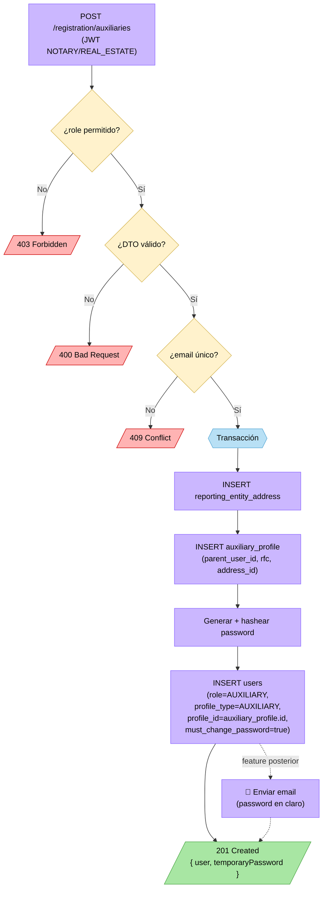

# Flujo de registro de auxiliares (NOTARY / REAL_ESTATE)

> Registro de usuarios `AUXILIARY` ejecutado desde la cuenta de un sujeto obligado (`NOTARY` o `REAL_ESTATE`). El auxiliar queda **asociado al sujeto obligado que lo registra**.

> 🎨 **UI vs BE**: el front presenta un wizard de 3 pasos (Tipo de usuario → Datos del usuario → Revisión y validación) con modal de confirmación antes del submit y modal de éxito/error al cerrar. El **back tiene un único endpoint** que recibe todo el payload junto. No hay persistencia parcial entre pasos. Capturas en [docs/designs/auxiliary-registration/](designs/auxiliary-registration/).

> 📝 **Etiquetas paso 1** (definidas sobre el diseño): el selector de "Tipo de usuario" muestra `Auxiliar` (antes `Interno (Trabajador)`) y `Clientes` (antes `Externo (Cliente)`). En BE, `Auxiliar` mapea al rol `AUXILIARY`; `Clientes` queda **fuera de scope** de este refinamiento — pendiente para una feature futura.

> 🚧 **Comportamiento de la opción `Clientes` en el wizard**: la opción está visible y seleccionable, pero **no dispara ningún flujo**. Al elegirla, el front muestra un estado de "Próximamente" (placeholder) en lugar de avanzar al paso 2. El botón "Siguiente" queda deshabilitado mientras la opción seleccionada sea `Clientes`. Sin endpoint, sin DTO, sin persistencia.

## Contexto y restricciones

- **Quién registra**: usuario autenticado con rol `NOTARY` o `REAL_ESTATE`. Nunca `SUPERADMIN` ni `AUXILIARY`.
- **A quién se asocia**: al `user_id` del notario/inmobiliaria que ejecuta el registro. **El sujeto obligado ES el espacio de trabajo** — no hay entidad `workspace` separada.
- **UI = 3 pasos, BE = 1 endpoint**: la navegación entre pasos es estado del front. El back recibe el formulario completo en una sola llamada y persiste en transacción única. No hay borrador, no hay TTL, no es retomable.
- **Perfil propio (`auxiliary_profile`)**: el auxiliar tiene su propia tabla de perfil, igual que PF y PM. `users` solo guarda credenciales, role y el FK al perfil vía `profile_type` + `profile_id`. RFC y domicilio van al perfil.
- **Credenciales**: se genera contraseña al guardar y se devuelve en el response del `201` para que la UI la muestre en modal **una sola vez** (copiable). El envío por correo queda fuera de scope hasta que exista servicio de email — mismo criterio que PF/PM. `users.must_change_password = true`.
- **Validación de campos**: misma política que el resto de los flujos de registro — `class-validator` en el DTO (back autoritativo, `400` si falla); el front bloquea "Siguiente" hasta completar. Reglas concretas (longitudes, regex de email/teléfono, RFC, CP) se reusan de los DTOs ya existentes en el módulo de registration.

## Asociación al sujeto obligado

Decisión: **`auxiliary_profile.parent_user_id` (uuid, NOT NULL, FK → `users.id`)**.

- Vive en el perfil, no en `users`, porque solo aplica a auxiliares.
- Se infiere del JWT del registrador — el front **no** lo manda.
- Restricción: el `parent_user.role` (columna `role` en tabla `users`) debe ser `NOTARY` o `REAL_ESTATE` (validado en service, no en BD — la FK sola no lo expresa).
- Listados de auxiliares en la UI del padre: `JOIN users u ON u.profile_id = ap.id WHERE ap.parent_user_id = <yo>`.
- Borrado de auxiliares: fuera de scope de este change.

> No se crea tabla `workspace`/`organization`. Si en el futuro un auxiliar debe pertenecer a múltiples sujetos obligados o el "espacio" gana atributos propios (nombre, settings, branding, permisos), se promueve a tabla pivote. Hoy YAGNI.

## Reutilización vs. nuevo

Auditando contra el schema de SUPERADMIN ([REGISTRO_SCHEMA.md](REGISTRO_SCHEMA.md)):

| Pieza | ¿Reusa? | Detalle |
|---|---|---|
| `users` (credenciales, role, profile FK) | ✅ | Mismo patrón que PF/PM: `profile_type = 'AUXILIARY'`, `profile_id = auxiliary_profile.id`. Hay que extender `ProfileType` con `AUXILIARY`. Los campos `first_name`, `paternal_surname`, `maternal_surname`, `email`, `phone` viven acá. |
| `reporting_entity_address` | ✅ | Reusada para el domicilio personal del auxiliar (entidad federativa, CP, localidad, colonia, calle, número exterior/interior). Ya tiene todas las columnas necesarias. |
| `contact` | ❌ | El form actual solo captura `phone` y `email`, ambos ya viven en `users`. No hay celular ni múltiples contactos → no aplica. |
| `vulnerable_activity` | ❌ | No aplica al auxiliar. |
| `compliance_responsible` | ❌ | Solo PM. |
| `registration` (wizard) | ❌ | UI hace los 3 pasos en cliente; el BE recibe todo junto y persiste en una transacción. Sin borrador ni TTL. |
| `auxiliary_profile` | 🆕 | Tabla nueva. Datos específicos del auxiliar que no caben en `users`: `parent_user_id`, `rfc`, `address_id`. |

## Cambios de schema requeridos

1. **Tabla nueva `auxiliary_profile`**:
   - `id CHAR(36) PK`
   - `parent_user_id CHAR(36) NOT NULL` — FK → `users.id`, `ON DELETE RESTRICT`
   - `rfc VARCHAR(13) NOT NULL`
   - `address_id CHAR(36) NOT NULL` — FK → `reporting_entity_address.id`, `ON DELETE RESTRICT`
   - `created_at`, `updated_at`
   - Index `idx_auxiliary_profile_parent` por `parent_user_id`.
2. **Extender enum `ProfileType`** ([pld-api/packages/shared-types/src/enums.ts:8](../pld-api/packages/shared-types/src/enums.ts#L8)) con `AUXILIARY = 'AUXILIARY'`.
3. **Type `AuxiliaryRegistration`** ([pld-api/libs/auth-profiles/src/lib/auth-profiles.types.ts:17](../pld-api/libs/auth-profiles/src/lib/auth-profiles.types.ts#L17)) — hoy solo `email`. Reemplazar por la forma completa del DTO de abajo.

> No se toca `contact`. La idea anterior de generalizarlo (polimórfico `owner_type`+`owner_id`) queda descartada porque la UI confirmada solo pide datos que ya viven en `users` (phone, email).

## Endpoint

`POST /registration/auxiliaries` — autenticado con JWT, requiere `role IN (NOTARY, REAL_ESTATE)`.

Body (DTO único — refleja todos los campos del wizard, capturados en paso 2):

| Campo | Tipo | Requerido | Destino |
|---|---|---|---|
| `firstName` | string | ✅ | `users.first_name` |
| `paternalSurname` | string | ✅ | `users.paternal_surname` |
| `maternalSurname` | string | ✅ | `users.maternal_surname` |
| `rfc` | string | ✅ | `auxiliary_profile.rfc` |
| `phone` | string | ✅ | `users.phone` |
| `email` | string | ✅ | `users.email` |
| `address.state` | string | ✅ | `reporting_entity_address.state` (entidad federativa) |
| `address.postalCode` | string | ✅ | `reporting_entity_address.postal_code` |
| `address.municipality` | string | ✅ | `reporting_entity_address.municipality` (UI: "Localidad o municipio") |
| `address.neighborhood` | string | ✅ | `reporting_entity_address.neighborhood` (colonia) |
| `address.street` | string | ✅ | `reporting_entity_address.street` (Calle, Av o Vía) |
| `address.exteriorNumber` | string | ✅ | `reporting_entity_address.exterior_number` |
| `address.interiorNumber` | string | ❌ | `reporting_entity_address.interior_number` |

> No se captura `celular` (la UI confirmada no lo pide). Tampoco `country`/`road_type`/`locality` — se omiten o se default-ean en BE (ej. `country = 'México'`).

Reglas concretas de validación (`@IsEmail`, regex de RFC, longitudes) se reusan de los DTOs del módulo `registration`.

Service (transacción única):
1. Validar que `parent_user.role IN (NOTARY, REAL_ESTATE)` — si no, `403`.
2. Verificar que `email` no exista en `users` → `409` si ya existe.
3. Insert en `reporting_entity_address` con los datos del bloque `address`.
4. Insert en `auxiliary_profile` con `parent_user_id = <jwt.sub>`, `rfc`, `address_id`.
5. Generar password aleatoria; hashearla con bcrypt.
6. Insert en `users` con `firstName`, `paternalSurname`, `maternalSurname`, `email`, `phone`, `role = 'AUXILIARY'`, `profile_type = 'AUXILIARY'`, `profile_id = <auxiliary_profile.id>`, `must_change_password = true`, `active = true`, `password_hash`.
7. Response `201`: `{ user: <UserDTO sin passwordHash>, temporaryPassword: "<plain>" }`. **La password no se expone nunca más.** (Envío de email fuera de scope.)

Errores:
- `400` — DTO inválido.
- `401` — sin JWT.
- `403` — JWT con rol distinto a `NOTARY`/`REAL_ESTATE`.
- `409` — email ya registrado.

## Diagrama

Diagrama solo del lado **BE** — el wizard de UI vive en las capturas de [docs/designs/auxiliary-registration/](designs/auxiliary-registration/).

> ⚠️ Envío de correo con la password queda **fuera de scope** (mismo criterio que PF/PM): no hay servicio de email implementado. La password temporal se devuelve en el response del `201` y la UI la muestra en modal copiable.

## Diferencias clave vs. flujo SUPERADMIN

| Aspecto | SUPERADMIN (sujeto obligado) | AUXILIARY |
|---|---|---|
| Quién ejecuta | `SUPERADMIN` | `NOTARY` o `REAL_ESTATE` |
| UI | Wizard largo con checkpoints reales | Wizard de 3 pasos solo en cliente |
| BE | 5–6 endpoints (uno por paso, persistencia parcial) | 1 endpoint único, todo en transacción |
| Persistencia | `registration` + `physical_person_profile`/`moral_person_profile` + `contact` + activity + address | `auxiliary_profile` + `reporting_entity_address` + `users` |
| Retomable | Sí (`expires_at`, `current_step`) | No |
| Asociación | Crea sujeto obligado independiente | Hijo de un sujeto obligado existente (`auxiliary_profile.parent_user_id`) |
| Password temporal | Devuelta en `POST /:id/finalize` | Devuelta en `POST /registration/auxiliaries` |
