# Flujo de registro de sujetos obligados (SUPERADMIN)

> Diagrama de referencia para el registro de sujetos obligados por parte de un `SUPERADMIN`. Dos tipos de sujeto obligado (Notarías, Inmobiliarias) y dos tipos de perfil (Persona Física, Persona Moral).

## Contexto y restricciones

- **Tipos de usuario del sistema**: `SUPERADMIN`, `NOTARIO`, `INMOBILIARIA`, `AUXILIAR` (más `USUARIO_INTERNO`, `USUARIO_EXTERNO` existentes en el enum). Notarías e Inmobiliarias son tipos de usuario; `SUPERADMIN` y `AUXILIAR` son los perfiles administrativos que operan el alta.
- **Tipo de perfil** (aplica al sujeto obligado): `PERSONA_FISICA` o `PERSONA_MORAL`.
- **Registro largo con checkpoints**: el flujo se compone de pasos discretos (identificación → contacto → actividad vulnerable → …). Cada paso termina con una validación y un `Guardar información` que persiste parcialmente y permite continuar. Debe ser posible **retomar un registro incompleto** (diseño a resolver — ver sección "Gap detectado").
- **Campos de entrada (cajas azules en el diagrama)**: datos que se capturan. Los marcados con `*` son **requeridos**. La validación visual es responsabilidad del front; la validación autoritativa vive en el back en el DTO de cada request.
- **Acciones grises** (p. ej. `Datos de contacto`): marcan el inicio de un paso. Al final de cada paso, el decisor `¿Los campos están completos?` aplica validaciones del front. Para back, esas validaciones son el `class-validator` del DTO de cada endpoint.
- **`Ingresa el dato faltante`**: acción solo del front — el botón "Guardar/Continuar" queda deshabilitado. En back no hay equivalente: simplemente rechaza con HTTP 400 si el DTO no valida.
- **`Guardar información`**: cierra el paso y habilita el siguiente. Para back, cada acción `Guardar información` se mapea a **un endpoint distinto** (`POST` o `PATCH` sobre un sub-recurso del registro).
- **Independencia entre perfiles**: los flujos de Persona Física y Persona Moral son **ramas independientes** (no se entrelazan) y tienen sus propias entidades de persistencia.
- ⚠️ **Importante**: dentro del flujo de Persona Moral, si aparece un nodo "Persona Física" hace referencia al **responsable del cumplimiento de la Ley**, NO al tipo de perfil. No confundirlos.
- 📝 **Leyendas del paso "Actividad vulnerable\*"** (*"Para el caso de Notarías deberá decir: FE PÚBLICA (SERVIDORES PÚBLICOS...)"* y *"En caso de inmobiliarias deberá decir: TRANSMISIÓN DE BIENES INMUEBLES"*): son **etiquetas / copy del front** — el nombre de la sección que se muestra al usuario según el tipo de sujeto obligado. **No son valores del dominio a persistir**. El backend recibe y valida únicamente el valor del enum `ActividadVulnerable` que le envía el front.

## Referencias de código

### Enums canónicos (`packages/shared-types/src/enums.ts`)

| Concepto | Enum / tipo | Archivo | Valores |
|---|---|---|---|
| Tipo de usuario | `UserRole` | [pld-api/packages/shared-types/src/enums.ts:1](../pld-api/packages/shared-types/src/enums.ts#L1) | `SUPERADMIN`, `NOTARIO`, `INMOBILIARIA`, `AUXILIAR`, `USUARIO_INTERNO`, `USUARIO_EXTERNO` |
| Tipo de perfil | `TipoPersonaParticipante` | [pld-api/packages/shared-types/src/enums.ts:10](../pld-api/packages/shared-types/src/enums.ts#L10) | `PERSONA_FISICA`, `PERSONA_MORAL`, `FIDEICOMISO` |
| Actividad vulnerable | `ActividadVulnerable` | [pld-api/packages/shared-types/src/enums.ts:26](../pld-api/packages/shared-types/src/enums.ts#L26) | `TRANSMISION_DERECHOS_REALES_INMUEBLES`, `PODERES_IRREVOCABLES`, `CONSTITUCION_SOCIEDADES`, `FUSION`, `ESCISION`, `AUMENTO_CAPITAL`, `DISMINUCION_CAPITAL`, `TRANSMISION_ACCIONES_PARTES`, `FIDEICOMISOS`, `MUTUOS_PRESTAMOS_CREDITOS` |

> Los mismos enums están re-exportados desde [pld-api/libs/catalogs/src/lib/catalogs.types.ts](../pld-api/libs/catalogs/src/lib/catalogs.types.ts) con nota de deprecation — preferir `@pld-api/shared-types`.

### Entidades TypeORM

**Persona Física** — [pld-api/libs/participants/src/lib/fisica/participants.entity.ts](../pld-api/libs/participants/src/lib/fisica/participants.entity.ts):
- `ParticipantPFBasicaEntity` (tabla `participantsFisicaBasico`) — identificación base.
- `ParticipantPFDomicilioEntity` (tabla `participantsFisicaDomicilio`) — domicilio.
- Otras: `ParticipantPFIdentificacionEntity`, `ParticipantPFDocumentoINMEntity`, `ParticipantPFDomicilioNacionalEntity`, `ParticipantPFDatosIdentificacionEntity`, `ParticipantPFBeneficiarioControladorEntity`, `ParticipantRepresentanteEntity`, `ParticipantRepresentanteDomicilioEntity`, `ParticipantRepresentanteIdentificacionEntity`.

**Persona Moral** — [pld-api/libs/participants/src/lib/moral/participants.entity.ts](../pld-api/libs/participants/src/lib/moral/participants.entity.ts):
- `ParticipantePMBasicoEntity` (tabla `moralAmbosBasico`) — identificación base. Campo local `tipoPersonaMoral: 'mexicana' | 'extranjera'`.
- `ParticipantePMDomicilioEntity` (tabla `moralAmbosDomicilio`) — domicilio.
- Otras: `ParticipantePMRepresentanteEntity`, `ParticipantePMIdentificacionRepresentanteEntity`, `ParticipantePMPEPEntity`, `ParticipantePMDocumentoMigratorioEntity`, `ParticipantePMDomicilioTerritorialNacionalEntity`, `ParticipantePMBeneficiarioControladorEntity`.

**Usuario** — [pld-api/packages/domain-auth-users/src/entities/user.entity.ts](../pld-api/packages/domain-auth-users/src/entities/user.entity.ts):
- Columna `role: varchar` (sin constraint enum en BD; TypeORM valida en runtime contra `UserRole`).

### Tipo `Domicilio` (interfaz, no entity embebida)

- [pld-api/packages/shared-types/src/person.ts:3](../pld-api/packages/shared-types/src/person.ts#L3) — campos: `calle`, `numeroExterior`, `numeroInterior?`, `colonia`, `municipioDemarcacion`, `ciudadPoblacion`, `entidadFederativaEstado`, `codigoPostal`, `pais`, `tipoVialidad?`, `localidad?`. Cada tabla de domicilio en persistencia tiene nombres de columna ligeramente distintos — uniformar al integrar.

## Gaps detectados durante el análisis

1. **No existe tracking de completitud de registro**. Ninguna entidad de participante tiene columnas `estado`, `pasoActual`, `completado`, `registrationStep` ni similares. Para soportar la restricción "es posible que quede algún registro sin completar" hay que **agregar estado de registro** — se resuelve en el change SDD asociado (`add-registro-sujetos-obligados`).
2. **`UserEntity.role` es `varchar`, no `enum` en BD**. La migración a `enum` nativo de MySQL reforzaría la validación — fuera de scope del registro, pero queda anotado.

## Change SDD asociado

El plan de implementación vive en [openspec/changes/add-registro-sujetos-obligados/](../openspec/changes/add-registro-sujetos-obligados/) (proposal, specs, design, tasks). Resumen: endpoints paso-a-paso bajo `/admin/registration/*` que persisten cada checkpoint del diagrama y permiten retomar registros incompletos.

## Schema de base de datos

El diagrama ER y las tablas que dan soporte al registro viven en [REGISTRO_SCHEMA.md](REGISTRO_SCHEMA.md). Resumen:
- Tablas principales por perfil: `physical_person_profile`, `moral_person_profile`.
- Tablas auxiliares reusables: `reporting_entity_address`, `contact`.
- Solo PM: `compliance_responsible`.
- Tablas de proceso: `registration`, `vulnerable_activity`.

## Diagrama

```mermaid
flowchart TD
    Inicio([Inicio]) --> CrearUsuario[Crear usuario]
    CrearUsuario --> TipoSujeto{Tipo de sujeto<br/>obligado a registrar}
    TipoSujeto --> Notarias[Notarías]
    TipoSujeto --> Inmobiliarias[Inmobiliarias]
    Notarias --> PersonaFisica[Persona Física]
    Inmobiliarias --> TipoPerfil{Tipo de perfil}
    TipoPerfil --> PersonaFisica
    TipoPerfil --> PersonaMoral[Persona Moral]

    PersonaFisica --> DatosIdentPF["Datos de identificación de quien<br/>realiza la Actividad Vulnerable"]
    DatosIdentPF --> PF_Nombre[/"Nombre*"/]
    PF_Nombre --> PF_ApPat[/"Apellido paterno*"/]
    PF_ApPat --> PF_ApMat[/"Apellido materno*"/]
    PF_ApMat --> PF_FechaNac[/"Fecha de nacimiento*"/]
    PF_FechaNac --> PF_RFC[/"RFC*"/]
    PF_RFC --> PF_CURP[/"CURP*"/]
    PF_CURP --> PF_PaisNac[/"País de nacionalidad"/]
    PF_PaisNac --> PF_PaisNacim[/"País de nacimiento"/]
    PF_PaisNacim --> PF_CamposCompletos{¿Los campos<br/>están completos?}
    PF_CamposCompletos -->|No| PF_IngresaFaltante[Ingresa el dato faltante]
    PF_IngresaFaltante --> DatosIdentPF
    PF_CamposCompletos -->|Sí| PF_IdentGuardar[Guardar información]
    PF_IdentGuardar --> DatosContacto

    DatosContacto["Datos de Contacto"]
    DatosContacto --> DC_ClaveLada[/"Clave lada"/]
    DC_ClaveLada --> DC_Telefono[/"Número de teléfono*"/]
    DC_Telefono --> DC_Correo[/"Correo electrónico*"/]
    DC_Correo --> DC_Celular[/"Celular*"/]
    DC_Celular --> DC_Nota["Se podrán registrar más de un<br/>dato de contacto"]
    DC_Nota --> DC_CamposCompletos{¿Los campos<br/>están completos?}
    DC_CamposCompletos -->|No| DC_IngresaFaltante[Ingresa el dato faltante]
    DC_IngresaFaltante --> DatosContacto
    DC_CamposCompletos -->|Sí| DC_Guardar[Guardar información]
    DC_Guardar --> ActividadVulnerable

    ActividadVulnerable["Actividad Vulnerable"]
    ActividadVulnerable --> AV_Actividad[/"<b>Actividad vulnerable*</b><br/>• Notarías: FE PÚBLICA (SERVIDORES PÚBLICOS...)<br/>• Inmobiliarias: TRANSMISIÓN DE BIENES INMUEBLES"/]
    AV_Actividad --> AV_FechaInicial[/"Fecha inicial"/]
    AV_FechaInicial --> AV_DomicilioTitulo["Domicilio principal de la<br/>actividad vulnerable"]
    AV_DomicilioTitulo --> AV_CP1[/"Código postal"/]
    AV_CP1 --> AV_Entidad[/"Entidad federativa"/]
    AV_Entidad --> AV_Delegacion[/"Delegación o municipio"/]
    AV_Delegacion --> AV_Localidad[/"Localidad"/]
    AV_Localidad --> AV_Colonia[/"Colonia"/]
    AV_Colonia --> AV_TipoVialidad[/"Tipo de vialidad"/]
    AV_TipoVialidad --> AV_NombreCalle[/"Nombre de la calle o vialidad"/]
    AV_NombreCalle --> AV_NumExt[/"Número exterior"/]
    AV_NumExt --> AV_NumInt[/"Número interior"/]
    AV_NumInt --> AV_CP2[/"Código postal"/]
    AV_CP2 --> AV_ActRealizada["Actividad vulnerable realizada<br/>en el domicilio:"]
    AV_ActRealizada --> AV_CamposCompletos{¿Los campos<br/>están completos?}
    AV_CamposCompletos -->|No| AV_IngresaFaltante[Ingresa el dato faltante]
    AV_IngresaFaltante --> ActividadVulnerable
    AV_CamposCompletos -->|Sí| AV_Guardar[Guardar información]
    AV_Guardar --> AV_Mensaje["Mostrar mensaje:<br/>Información de perfil actualizada"]
    AV_Mensaje --> Fin([Fin])

    PersonaMoral --> DatosIdentPM["Datos de identificación de quien<br/>realiza la Actividad Vulnerable"]
    DatosIdentPM --> PM_Denominacion[/"Denominación o razón social*:"/]
    PM_Denominacion --> PM_FechaConst[/"Fecha de constitución:"/]
    PM_FechaConst --> PM_RFC[/"RFC*"/]
    PM_RFC --> PM_PaisNac[/"País de nacionalidad:"/]
    PM_PaisNac --> PM_CamposCompletos{¿Los campos<br/>están completos?}
    PM_CamposCompletos -->|No| PM_IngresaFaltante[Ingresa el dato faltante]
    PM_IngresaFaltante --> DatosIdentPM
    PM_CamposCompletos -->|Sí| PM_IdentGuardar[Guardar información]
    PM_IdentGuardar --> DatosContactoPM

    DatosContactoPM["Datos de Contacto"]
    DatosContactoPM --> PMC_ClaveLada[/"Clave lada"/]
    PMC_ClaveLada --> PMC_Telefono[/"Número de teléfono:"/]
    PMC_Telefono --> PMC_Correo[/"Correo electrónico*"/]
    PMC_Correo --> PMC_Celular[/"Celular*"/]
    PMC_Celular --> PMC_Nota["Se podrán registrar más de un<br/>dato de contacto"]
    PMC_Nota --> PMC_CamposCompletos{¿Los campos<br/>están completos?}
    PMC_CamposCompletos -->|No| PMC_IngresaFaltante[Ingresa el dato faltante]
    PMC_IngresaFaltante --> DatosContactoPM
    PMC_CamposCompletos -->|Sí| PMC_Guardar[Guardar información]
    PMC_Guardar --> ActividadVulnerablePM

    ActividadVulnerablePM["Actividad Vulnerable"]
    ActividadVulnerablePM --> PMAV_Actividad[/"<b>Actividad vulnerable*</b><br/>• Inmobiliarias: TRANSMISIÓN DE BIENES INMUEBLES"/]
    PMAV_Actividad --> PMAV_FechaInicial[/"Fecha inicial"/]
    PMAV_FechaInicial --> PMAV_DomicilioTitulo["Domicilio principal de la<br/>actividad vulnerable"]
    PMAV_DomicilioTitulo --> PMAV_CP1[/"Código postal"/]
    PMAV_CP1 --> PMAV_Entidad[/"Entidad federativa"/]
    PMAV_Entidad --> PMAV_Delegacion[/"Delegación o municipio"/]
    PMAV_Delegacion --> PMAV_Localidad[/"Localidad"/]
    PMAV_Localidad --> PMAV_Colonia[/"Colonia"/]
    PMAV_Colonia --> PMAV_TipoVialidad[/"Tipo de vialidad"/]
    PMAV_TipoVialidad --> PMAV_NombreCalle[/"Nombre de la calle o vialidad"/]
    PMAV_NombreCalle --> PMAV_NumExt[/"Número exterior"/]
    PMAV_NumExt --> PMAV_CP2[/"Código postal"/]
    PMAV_CP2 --> PMAV_ActRealizada["Actividad vulnerable realizada<br/>en el domicilio:"]
    PMAV_ActRealizada --> PMAV_CamposCompletos{¿Los campos<br/>están completos?}
    PMAV_CamposCompletos -->|No| PMAV_IngresaFaltante[Ingresa el dato faltante]
    PMAV_IngresaFaltante --> ActividadVulnerablePM
    PMAV_CamposCompletos -->|Sí| PMAV_Guardar[Guardar información]
    PMAV_Guardar --> ResponsableLey

    ResponsableLey["Responsable del Cumplimiento de la Ley"]
    ResponsableLey --> RCL_PersonaFisica["Persona física"]
    RCL_PersonaFisica --> RCL_Nombre[/"Nombre*"/]
    RCL_Nombre --> RCL_ApPat[/"Apellido paterno*"/]
    RCL_ApPat --> RCL_ApMat[/"Apellido materno*"/]
    RCL_ApMat --> RCL_FechaNac[/"Fecha de nacimiento"/]
    RCL_FechaNac --> RCL_RFC[/"RFC*"/]
    RCL_RFC --> RCL_CURP[/"CURP*"/]
    RCL_CURP --> RCL_PaisNac[/"País de nacionalidad"/]
    RCL_PaisNac --> RCL_FechaDesig[/"Fecha de designación"/]
    RCL_FechaDesig --> RCL_CamposCompletos{¿Los campos<br/>están completos?}
    RCL_CamposCompletos -->|No| RCL_IngresaFaltante[Ingresa el dato faltante]
    RCL_IngresaFaltante --> ResponsableLey
    RCL_CamposCompletos -->|Sí| RCL_Guardar[Guardar información]
    RCL_Guardar --> RCL_Mensaje["Mensaje: Información de<br/>perfil Actualizada"]
    RCL_Mensaje --> Fin

    classDef inicioFin fill:#d3d3d3,stroke:#7a7a7a,color:#000;
    classDef accion fill:#cbb7ff,stroke:#8c68ff,color:#000;
    classDef guardar fill:#fff2cc,stroke:#d6b656,color:#000;
    classDef titulo fill:#4a4a4a,stroke:#2a2a2a,color:#fff;
    classDef subtitulo fill:#ffb84d,stroke:#cc7a00,color:#000;
    classDef campo fill:#b8e0f5,stroke:#5aa9d6,color:#000;
    classDef decision fill:#a8e6a3,stroke:#4fa84a,color:#000;

    class Inicio,Fin inicioFin;
    class CrearUsuario,Notarias,Inmobiliarias,PersonaFisica,PersonaMoral,PF_IngresaFaltante,DC_Nota,DC_IngresaFaltante,AV_ActRealizada,AV_IngresaFaltante,AV_Mensaje,PM_IngresaFaltante,PMC_Nota,PMC_IngresaFaltante,PMAV_ActRealizada,PMAV_IngresaFaltante,RCL_IngresaFaltante,RCL_Mensaje accion;
    class PF_IdentGuardar,DC_Guardar,AV_Guardar,PM_IdentGuardar,PMC_Guardar,PMAV_Guardar,RCL_Guardar guardar;
    class DatosIdentPF,DatosContacto,ActividadVulnerable,DatosIdentPM,DatosContactoPM,ActividadVulnerablePM,ResponsableLey titulo;
    class AV_DomicilioTitulo,PMAV_DomicilioTitulo,RCL_PersonaFisica subtitulo;
    class PF_Nombre,PF_ApPat,PF_ApMat,PF_FechaNac,PF_RFC,PF_CURP,PF_PaisNac,PF_PaisNacim,DC_ClaveLada,DC_Telefono,DC_Correo,DC_Celular,AV_Actividad,AV_FechaInicial,AV_CP1,AV_Entidad,AV_Delegacion,AV_Localidad,AV_Colonia,AV_TipoVialidad,AV_NombreCalle,AV_NumExt,AV_NumInt,AV_CP2,PM_Denominacion,PM_FechaConst,PM_RFC,PM_PaisNac,PMC_ClaveLada,PMC_Telefono,PMC_Correo,PMC_Celular,PMAV_Actividad,PMAV_FechaInicial,PMAV_CP1,PMAV_Entidad,PMAV_Delegacion,PMAV_Localidad,PMAV_Colonia,PMAV_TipoVialidad,PMAV_NombreCalle,PMAV_NumExt,PMAV_CP2,RCL_Nombre,RCL_ApPat,RCL_ApMat,RCL_FechaNac,RCL_RFC,RCL_CURP,RCL_PaisNac,RCL_FechaDesig campo;
    class TipoSujeto,TipoPerfil,PF_CamposCompletos,DC_CamposCompletos,AV_CamposCompletos,PM_CamposCompletos,PMC_CamposCompletos,PMAV_CamposCompletos,RCL_CamposCompletos decision;
```

