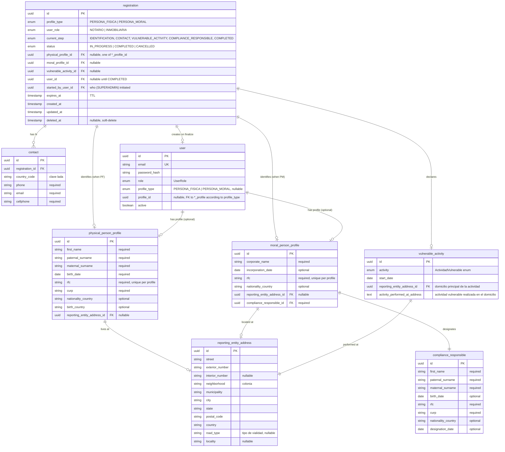

# Schema del registro de sujetos obligados

> Propuesta de esquema de BD para el módulo de registro (`/admin/registration/*`). Complementa el flujo documentado en [FLUJO_REGISTRO_SUPERADMIN.md](FLUJO_REGISTRO_SUPERADMIN.md) y se referencia desde el change SDD [add-registro-sujetos-obligados](../openspec/changes/add-registro-sujetos-obligados/).

## Convenciones

- **Todas las tablas y columnas en inglés.** Las tablas ya existentes en `libs/participants/` están en español — ese refactor es otro change (`rename-to-english`).
- **Tablas principales** nombradas por el perfil: `physical_person_profile`, `moral_person_profile`.
- **Tablas auxiliares** (relaciones 1:N, datos comunes reusables): `contact`, `reporting_entity_address`, `compliance_responsible`.
- Un **perfil unifica los datos persistentes** del sujeto obligado. El registro (`registration`) es el "borrador" del proceso; una vez completado, los datos del perfil se consolidan y se crea el `user`.

## Qué es común entre Persona Física y Persona Moral

Auditoría del codebase ([pld-api/libs/participants/src/lib/fisica/participants.entity.ts](../pld-api/libs/participants/src/lib/fisica/participants.entity.ts), [pld-api/libs/participants/src/lib/moral/participants.entity.ts](../pld-api/libs/participants/src/lib/moral/participants.entity.ts)):

| Estructura | PF | PM | ¿Reusable? |
|---|---|---|---|
| Domicilio | `participantsFisicaDomicilio` | `moralAmbosDomicilio` | ✅ 13 de 14 columnas idénticas. Se unifica en `reporting_entity_address` (usada por perfil PF, perfil PM y `vulnerable_activity`). |
| Contacto | **no existe** (embebido en domicilio) | **no existe** | 🆕 Tabla `contact` nueva con `country_code`, `phone`, `email`, `cellphone`. |
| Actividad vulnerable | **no existe** | **no existe** | 🆕 Tabla `vulnerable_activity` nueva. |
| Responsable del cumplimiento de la Ley | N/A (no existe en flujo PF) | **no existe** | 🆕 Tabla `compliance_responsible` nueva (solo PM). |
| Identificación (documento) / Representante legal | `participantsFisicaIdentificacion`, `participantsFisicaRepresentante` | `moralAmbosIdentificacionRepresentante`, `moralAmbosRepresentante` | ❌ **No forman parte del flujo actual** de registro. Existen en el codebase legacy pero el diagrama no las contempla. |

> El change actual **no migra** las tablas de `libs/participants/`. Solo crea las tablas nuevas del módulo de registro con la estructura ya unificada y en inglés, para sentar el precedente.

## Decisiones cerradas

1. **Perfiles**: un `user` puede tener 0 o 1 perfil. No son extensibles; solo existen `PERSONA_FISICA` y `PERSONA_MORAL`. El `user` referencia al perfil vía `profile_type` + `profile_id`.
2. **Contactos**: múltiples por registro. Tabla hija `contact` con FK al registro.
3. **User se crea al finalizar el registro**, no antes. Durante el flujo, el registro vive sin `user_id`.
4. **TTL**: columna `expires_at` en el registro. Al consultar listados, se filtra por `expires_at > NOW()` — no hace falta cron. Si vence, el registro queda inaccesible vía listado pero puede consultarse directamente por id (para auditoría).
5. **Estado**: enum `IN_PROGRESS | COMPLETED | CANCELLED`. `CANCELLED` es soft-delete. El "abandonado" no es un estado propio — se deriva de `expires_at < NOW() AND status = 'IN_PROGRESS'`.
6. **Deduplicación de registros en curso**: por `rfc` del sujeto obligado (disponible desde el paso 1). Si existe otro `registration` con `status = 'IN_PROGRESS'` y el mismo RFC → `409` con el id del existente.
7. **Responsable del cumplimiento (solo PM)**: persona física que designa la moral. Vive en tabla dedicada `compliance_responsible`, con FK 1:1 desde `moral_person_profile` (NOT NULL). Campos del flujo: nombre, apellidos, fecha nacimiento, RFC, CURP, país nacionalidad, fecha de designación.
8. **PF no tiene representante**. El flujo de registro de persona física no incluye representante legal ni responsable del cumplimiento — la persona se representa a sí misma.
9. **PF/PM no capturan documento de identificación en el flujo actual**. El diagrama solo captura campos de perfil (nombre, RFC, CURP, etc.). Si en el futuro se agrega subida de INE/pasaporte, se crea una tabla `identification_document` separada.
10. **Ninguna FK hacia `libs/participants/`**. Las tablas nuevas de registro son independientes de las entities legacy.
11. **Deduplicación por RFC**: no se permiten dos `registration` con `status = IN_PROGRESS` y el mismo RFC. Validación en el adapter (transacción + `SELECT … FOR UPDATE`). Violación → `HTTP 409` con el `id` del existente.
12. **TTL configurable por env var**: `REGISTRATION_TTL_DAYS`, default `30`. El controller calcula `expires_at = NOW() + ttl` al crear el registration.
13. **Listado oculta vencidos por default**: `GET /admin/registration` filtra `expires_at > NOW()`. Query param opcional `includeExpired=true` para auditoría.
14. **Password temporal solo una vez**: `POST /:id/finalize` devuelve la password en texto plano una única vez en el response. No se persiste ni se expone por otro endpoint. Si se pierde, se requerirá reset (fuera de scope de este change).
15. **Sin auditoría detallada por paso**: solo se guarda `started_by_user_id`. La auditoría completa (quién tocó qué paso) queda para un change futuro.
16. **Cancelación (`DELETE`) diferida**: soft-delete vía `status = CANCELLED` y columna `deleted_at` quedan en el schema como preparación, pero el endpoint de cancelación no se implementa en este change.

## Diagrama ER

## Tablas (resumen)

### Principales por perfil

- **`physical_person_profile`** — datos consolidados del sujeto obligado persona física.
- **`moral_person_profile`** — datos consolidados del sujeto obligado persona moral.

### Del proceso de registro

- **`registration`** — borrador/trámite. Vive desde el inicio del wizard hasta finalización. Tras `COMPLETED` queda como histórico.
- **`contact`** — contactos (1:N con `registration`). Múltiples contactos permitidos.
- **`vulnerable_activity`** — actividad vulnerable declarada. 1:1 con `registration`.

### Comunes (reusables)

- **`reporting_entity_address`** — domicilios del sujeto obligado y de la actividad vulnerable. Reusada por `physical_person_profile`, `moral_person_profile` y `vulnerable_activity`.

### Solo PM

- **`compliance_responsible`** — responsable del cumplimiento de la Ley. Persona física que designa la moral (nombre, apellidos, RFC, CURP, fecha de designación).

### Extendida

- **`user`** — agregar columnas `profile_type` (enum nullable) y `profile_id` (uuid nullable). Se llena al finalizar el registro.

## Flujo de persistencia paso a paso

1. **`POST /admin/registration`** (el "Crear usuario" del diagrama — es el acto de iniciar el trámite) — validar en transacción que no exista otro `registration` con `status = IN_PROGRESS` y el mismo `rfc` (payload). Insert en `registration` con `profile_type`, `user_role`, `expires_at = NOW() + REGISTRATION_TTL_DAYS`, `started_by_user_id = <SUPERADMIN>`, `status = 'IN_PROGRESS'`, `current_step = 'IDENTIFICATION'`. Si ya existe → `HTTP 409` con el `id` existente.
2. **`POST /:id/identification`** — insert en `physical_person_profile` o `moral_person_profile` según `profile_type`; update `registration.physical_profile_id` o `moral_profile_id`, avanza `current_step`.
3. **`POST /:id/contact`** — insert en `contact` (se puede llamar N veces). Avanza `current_step` en el primer call.
4. **`POST /:id/vulnerable-activity`** — insert en `reporting_entity_address` (domicilio de la actividad) + insert en `vulnerable_activity`; update `registration.vulnerable_activity_id`, avanza `current_step`.
5. **`POST /:id/compliance-responsible`** (**solo PM**) — insert en `compliance_responsible`; update `moral_person_profile.compliance_responsible_id` (referenciado vía `registration.moral_profile_id`); avanza `current_step` en `registration`.
6. **`POST /:id/finalize`** — transacción única:
   1. Validar que todos los pasos requeridos estén hechos.
   2. Generar password aleatoria; crear `user` con password hasheada (email tomado del primer `contact`).
   3. Setear `user.profile_type` y `user.profile_id`.
   4. Update `registration.user_id`, `status = 'COMPLETED'`, `current_step = 'COMPLETED'`.
   5. Retornar el `user` + **password temporal en texto plano (única vez)**. El front debe mostrarla al SUPERADMIN en esa misma respuesta; no se expone nunca más.

## Listado y lectura

- **`GET /admin/registration`** — lista registros con `expires_at > NOW()` y `status != CANCELLED` por default. Query params opcionales: `?status=IN_PROGRESS|COMPLETED`, `?includeExpired=true`.
- **`GET /admin/registration/:id`** — devuelve el registro completo con sus datos acumulados; permite retomar un registro `IN_PROGRESS` no vencido. Si está vencido, devuelve `410 Gone` (o `404` — a definir en specs).

## Cosas NO reusadas de `libs/participants/` (deuda)

- Entities legacy en español siguen existiendo. El change de `rename-to-english` las migrará.
- Futuras migraciones podrían consolidar `participantsFisicaBasico` → `physical_person_profile`, pero hoy viven en paralelo.
- Endpoints legacy que persisten sobre `participantsFisicaBasico` no se tocan.
