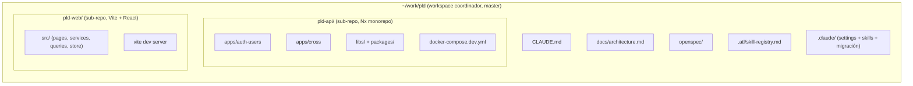
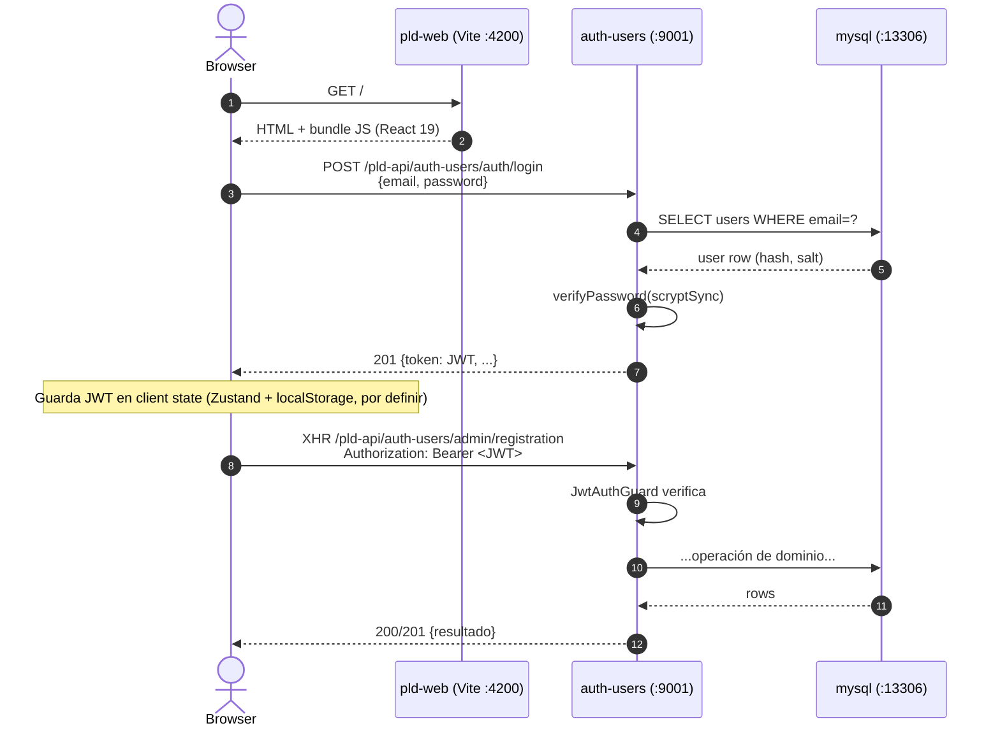
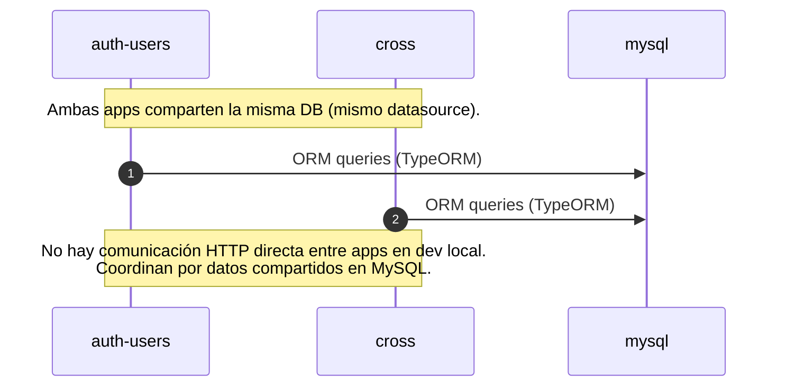

# pld — Arquitectura de dev local

> Este documento describe la **arquitectura de desarrollo local** del workspace pld. NO es la arquitectura productiva del proyecto — la real está documentada en los canales internos del equipo (Confluence / wiki), y este doc la respeta sin modificarla.
>
> **Propósito**: dejar claro cómo se comunican los componentes cuando corrés todo en tu máquina, qué puertos usa cada cosa, y qué utilidades locales (apps de debug, bots de automatización de pruebas, conexiones a ambientes remotos) podés agregar SIN que eso contamine la arquitectura productiva.

---

## 1. Topología del workspace



Los dos sub-repos conservan sus propios `.git` y remotes. El root del workspace es otro repo git (master, sin remote) que solo trackea la capa de coordinación — CLAUDE.md, docs, openspec, .atl, .claude, .gitignore.

---

## 2. Componentes locales en dev

| Componente | Puerto host | Tecnología | Comando de arranque | Config origen |
|------------|-------------|------------|---------------------|---------------|
| `auth-users` (BE) | `9001` | NestJS 9 | `pnpm nx run auth-users:serve` (o via docker) | [pld-api/docker-compose.dev.yml](../pld-api/docker-compose.dev.yml) |
| `cross` (BE) | definido por `cross` app | NestJS 9 | `pnpm nx run cross:serve` | — |
| `mysql` (BE db) | `13306` | MySQL 8 | docker compose up | [pld-api/docker-compose.dev.yml](../pld-api/docker-compose.dev.yml) |
| `pld-web` (front) | `4200` (default Vite) | Vite 7 + React 19 | `yarn dev` en `pld-web/` | [pld-web/vite.config.ts](../pld-web/vite.config.ts) |

Los puertos son defaults del desarrollo local. Si chocan con otra cosa en tu máquina, ajustar en `.env` de cada sub-repo y documentar acá.

---

## 3. Flujo runtime — web ↔ API (dev local)



**Detalles clave**:
- El prefix global del BE es `/pld-api/auth-users`. La web lo usa como base URL en dev: `http://localhost:9001/pld-api/auth-users`.
- Swagger en dev: [http://localhost:9001/pld-api/auth-users/docs](http://localhost:9001/pld-api/auth-users/docs) — fuente de verdad de los contratos.
- En Fase 5 del plan de reorganización BE se planea simplificar el prefix a `/pld-api` (ver [PLAN_REORGANIZACION_MONOREPO.md](PLAN_REORGANIZACION_MONOREPO.md) §5). Hasta entonces, la web debe usar el prefix largo.

---

## 4. Flujo runtime — API interna (auth-users ↔ cross)



Ambas apps del monorepo Nx usan la misma configuración de TypeORM (via `@pld-api/persistence`), apuntando a la misma DB `pld_api_bd`. No hay un bus de eventos local — cross lee datos que auth-users escribió, y viceversa.

Cuando el plan de reorganización BE avance a Fase 3 (`domain-audit` + `EventPublisher`), habrá un flujo async dominado por eventos. Actualizar este diagrama cuando eso pase.

---

## 5. Utilidades locales (apps / bots / conexiones de debug)

Este es el espacio donde se pueden agregar componentes que NO son parte de la arquitectura productiva del proyecto. Ejemplos típicos:

- **Apps auxiliares**: un dashboard local para inspeccionar el estado de la DB, un proxy que loguee todas las peticiones entre web y API, una app CLI que corra smoke tests.
- **Bots de automatización**: un script que cree datos de prueba, un bot que corra el flujo de login en loop para detectar regressions, un runner que valide el CHECKLIST_MIGRACION.md automáticamente.
- **Conexiones a ambientes remotos**: un tunnel SSH a staging para debugear con datos reales, un proxy que redirija tráfico del BE local a una DB remota, un wrapper que haga dump/restore de la DB de staging a local.

**Reglas de las utilidades locales**:

1. **No se suben al proyecto real**. Viven en el workspace (o ramas locales de los sub-repos) pero nunca se commitean al `main` de los sub-repos.
2. **No modifican los contratos productivos**. Si una utilidad necesita un endpoint nuevo en el BE, ese endpoint se evalúa como change SDD real (entra por `openspec/changes/`), no se parchea localmente.
3. **Se documentan acá**. Cada utilidad activa tiene una entrada en la tabla de abajo: qué hace, cómo arrancarla, qué puertos usa, si toca algún dato sensible.
4. **Respetan las credenciales**. Si la utilidad se conecta a staging/prod, usa credenciales personales del dev. Nunca hardcodear secrets en archivos trackeados.
5. **Reversibles**. Apagar la utilidad deja el dev local igual que antes.

### Tabla de utilidades activas

| Utilidad | Propósito | Ubicación | Puerto | Estado |
|----------|-----------|-----------|--------|--------|
| _(ninguna todavía)_ | — | — | — | — |

Cuando agregues una, llená una fila y describí en una subsección (§5.x) el detalle.

---

## 6. Reglas de workspace

- Claude siempre se abre desde `/home/cristobal/work/pld/`. Nunca desde `pld-api/` ni `pld-web/` directamente (no tienen `CLAUDE.md` propio).
- Los sub-repos están gitignoreados a nivel workspace. No `git add pld-api/` ni `git add pld-web/` desde el root.
- Cambios cross-repo se planean con un único change SDD desde `pld/openspec/`. Ver [openspec/config.yaml](../openspec/config.yaml).
- Los paths en docs, skill-registry y openspec son absolutos desde el workspace: `pld-api/apps/...`, `pld-web/src/...`.
- Este doc (`architecture.md`) se actualiza cuando cambia la topología local, los puertos, o los flujos. No cuando cambia la arquitectura productiva (esa vive en otro lado).

---

## 7. Comandos del stack dev (skills `stack-*`)

Las 4 skills de proyecto en [.claude/skills/](../.claude/skills/) encapsulan los comandos habituales. Se ejecutan SIEMPRE desde el root del workspace.

```bash
/stack-up                    # BE (docker) + Web (Vite background)  ← default
/stack-up --no-web           # solo BE
/stack-up --no-be            # solo Web
/stack-up --rebuild          # BE con --build

/stack-down                  # baja todo
/stack-down --volumes        # + borra mysql data (reset total)

/stack-status                # docker compose ps + PID Vite + curl de health
/stack-status --be           # solo BE
/stack-status --web          # solo Web

/stack-logs                  # últimas 100 líneas de BE + Web
/stack-logs -f               # follow de ambos
/stack-logs --be auth-users  # filtrar por servicio del compose
/stack-logs --tail 500       # más historial
```

**Estado runtime de Web** (PID + log) vive en `pld/.stack/` — gitignoreado. Si la skill se rompe, el proceso de Vite queda huérfano: `pkill -f vite` lo mata y borrá manualmente `pld/.stack/web.pid`.

**Observación — `cross`**: el servicio está comentado en `pld-api/docker-compose.dev.yml`. Si lo necesitás activo, descomentalo manualmente — las skills no tienen flag para habilitarlo dinámicamente (decisión consciente: tenerlo siempre off por default).

---

## 8. Rollback del coordinador

El workspace es aditivo. Para desarmarlo sin tocar los sub-repos:

```bash
cd ~/work/pld
rm -rf .git .atl .claude docs openspec CLAUDE.md .gitignore
```

Los sub-repos `pld-api/` y `pld-web/` quedan intactos — siguen con su git, sus remotes, su código. Recuperar el contexto Claude que tenían antes requiere restaurar `pld-api/.atl/`, `pld-api/.claude/`, `pld-api/openspec/`, `pld-api/CLAUDE.md`, `pld-api/temp-docs/` desde el último commit o backup (ninguno estaba trackeado en el `.git` del sub-repo, ver `pld-api/.git/info/exclude`).
