# Flujo de inicio de sesión

> Diagrama de referencia para el inicio de sesión de usuarios. Cubre validación de credenciales, estado de cuenta y recuperación de contraseña.

## Descripción del flujo

1. El usuario accede a la pantalla **Inicio de Sesión**.
2. Ingresa su **correo electrónico o número telefónico** y su **contraseña**.
3. El sistema valida las credenciales:
   - **Datos correctos + cuenta activa** → ingresa al sistema (fin).
   - **Datos correctos + cuenta inactiva** → muestra mensaje *"Cuenta inactiva, comunícate con el administrador."* y regresa a Inicio de Sesión.
   - **Datos incorrectos** → muestra *"Verifica tus datos"* y regresa a Inicio de Sesión para reintentar.
4. Desde el inicio, el usuario puede optar por **¿Olvidaste tu contraseña?**, que deriva al subflujo de **Recuperación de contraseña**.

## Subflujo: recuperación de contraseña

1. El usuario ingresa el **correo electrónico** con el que desea recuperar la contraseña.
2. El sistema valida si el correo está **registrado**:
   - **No registrado** → muestra *"Revisar el correo"* y regresa al paso de ingreso de correo.
   - **Registrado** → envía un **enlace de recuperación** al correo electrónico.
3. El usuario **abre el enlace** y captura la **nueva contraseña** junto con su **confirmación**.
4. El sistema valida que ambas coincidan:
   - **No coinciden** → muestra *"Verifica tus datos"* y regresa al ingreso de la nueva contraseña.
   - **Coinciden** → almacena la nueva contraseña y **redirecciona al inicio de sesión** (fin del subflujo, vuelve a `Inicio de Sesión`).

## Diagrama

```mermaid
flowchart LR
    inicio([inicio])
    login[Inicio de Sesión]
    olvido[¿Olvidaste tu contraseña?]
    ingresaEmail[/ingresa el correo electrónico<br/>o número telefónico/]
    ingresaPass[/ingresa la contraseña/]
    valida{Los Datos<br/>son correctos}
    inactiva[Mensaje: Cuenta inactiva,<br/>comunícate con el administrador.]
    reintento[Volver a ingresar los datos<br/>'Verifica tus datos']
    ingresa[ingresa al sistema]
    fin([Fin])

    %% Subflujo: recuperación de contraseña
    recuperar[Recuperar contraseña]
    ingresaCorreoRec[/Ingresa el correo electrónico,<br/>para recuperar contraseña/]
    correoRegistrado{¿El correo está<br/>registrado?}
    revisarCorreo[Revisar el correo]
    correoOk[El correo es correcto y<br/>está registrado]
    enviarEnlace[Envío de enlace de recuperación<br/>al correo electrónico]
    abrirEnlace[Abrir enlace para cambiar contraseña]
    nuevaPass[/ingresa la nueva contraseña/]
    confirmaPass[/confirma la nueva contraseña/]
    coinciden{Los Datos<br/>coinciden}
    reintentoPass[Volver a ingresar los datos<br/>'Verifica tus datos']
    datosAlmacenados[(Datos Almacenado)]
    redirect[Redireccionar al sistema para inicio de sesión]
    finRec([Fin])

    inicio --> login
    login --> olvido
    login --> ingresaEmail
    ingresaEmail --> ingresaPass
    ingresaPass --> valida
    valida -- Sí --> ingresa
    valida -- No --> reintento
    valida -- Cuenta inactiva --> inactiva
    inactiva --> login
    reintento --> login
    ingresa --> fin

    %% Transición al subflujo
    olvido --> recuperar
    recuperar --> ingresaCorreoRec
    ingresaCorreoRec --> correoRegistrado
    correoRegistrado -- No --> revisarCorreo
    revisarCorreo --> ingresaCorreoRec
    correoRegistrado -- Sí --> correoOk
    correoOk --> enviarEnlace
    enviarEnlace --> abrirEnlace
    abrirEnlace --> nuevaPass
    nuevaPass --> confirmaPass
    confirmaPass --> coinciden
    coinciden -- No --> reintentoPass
    reintentoPass --> nuevaPass
    coinciden -- Sí --> datosAlmacenados
    datosAlmacenados --> redirect
    redirect --> finRec
    finRec --> login

    %% Estilos (paleta de las imágenes originales)
    classDef startEnd fill:#d9d9d9,stroke:#8a8a8a,stroke-width:1px,color:#000
    classDef action fill:#c6b8ff,stroke:#7c5cff,stroke-width:1px,color:#000
    classDef input fill:#bfe4ff,stroke:#3fa9f5,stroke-width:1px,color:#000
    classDef decision fill:#b8e6c1,stroke:#4caf50,stroke-width:1px,color:#000
    classDef storage fill:#ffe6a3,stroke:#f0ad4e,stroke-width:1px,color:#000

    class inicio,fin,finRec startEnd
    class login,olvido,inactiva,reintento,ingresa,recuperar,revisarCorreo,correoOk,enviarEnlace,abrirEnlace,reintentoPass,redirect action
    class ingresaEmail,ingresaPass,ingresaCorreoRec,nuevaPass,confirmaPass input
    class valida,correoRegistrado,coinciden decision
    class datosAlmacenados storage
```



<!-- jarvis:llm-index type=flow-design-mapping hide=true description="Índice toon que agrupa nodos del diagrama BE por pantalla UI. nodos_diagrama lista todos los nodos que esa pantalla implementa. disenos lista screenshots disponibles. nota registra inconsistencias o vacíos pendientes." -->

```toon
steps[4]{step_ui,label_ui,variante,nodos_diagrama,disenos,nota}:
  1,Inicio de sesión,-,"inicio+login+ingresaEmail+ingresaPass+valida+inactiva+reintento+ingresa+fin+olvido",,VACÍO: sin diseño UI — ver flujo recuperacion-contrasena para el subflujo
  2,Recuperar contraseña — ingresar correo,-,"recuperar+ingresaCorreoRec+correoRegistrado+revisarCorreo+correoOk",,VACÍO: sin diseño en este flujo — diseños en docs/flujos/recuperacion-contrasena/
  3,Recuperar contraseña — nueva contraseña,-,"enviarEnlace+abrirEnlace+nuevaPass+confirmaPass+coinciden+reintentoPass+datosAlmacenados+redirect+finRec",,VACÍO: sin diseño en este flujo — diseños en docs/flujos/recuperacion-contrasena/
```
