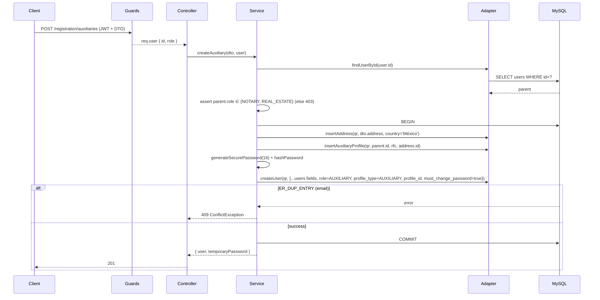

# Design: Add auxiliary registration endpoint (BE)

## Technical Approach

Endpoint Nest único `POST /registration/auxiliaries` con módulo nuevo bajo `apps/auth-users/src/registration/auxiliaries/` siguiendo el patrón **controller → service → adapter** ya establecido en `apps/auth-users/src/admin/registration/`. Persistencia en transacción única (`dataSource.transaction(qr => …)`) con 3 INSERTs: `reporting_entity_address` → `auxiliary_profile` → `users`. Reusa los helpers `generateSecurePassword(16)` y `hashPassword()` exportados por `@pld-api/domain-auth-users`. Cubre los 8 requirements del spec `auxiliary-registration`.

## Architecture Decisions

### Decision: Módulo separado, no extender `admin/registration/`

**Choice**: nuevo módulo `apps/auth-users/src/registration/auxiliaries/` (controller + service + adapter + DTO + entity + module).
**Alternatives considered**: agregar handler dentro de `admin/registration/registration.controller.ts`.
**Rationale**: distinto operador (NOTARY/REAL_ESTATE vs SUPERADMIN), distinto path (`/registration/auxiliaries` vs `/admin/registration`), distinto scope de datos. Mezclarlos forzaría guards condicionales y enredaría tests.

### Decision: Path `/registration/auxiliaries`

**Choice**: `POST /registration/auxiliaries`.
**Alternatives considered**: `/admin/registration/auxiliaries` (rechazado: prefijo `admin` se reserva para SUPERADMIN), `/auxiliaries` (rechazado: pierde el contexto del dominio "registration").
**Rationale**: alinea con la convención del módulo registration y deja espacio para `GET /registration/auxiliaries` (listado) en una feature posterior.

### Decision: Entity y migración alineadas al patrón existente

**Choice**: `AuxiliaryProfileEntity` en `apps/auth-users/src/registration/auxiliaries/entities/auxiliary-profile.entity.ts` (mismo patrón que `physical-person-profile.entity.ts`). Migration `20260428000000-create-auxiliary-profile.sql` + down en `packages/persistence/migrations/`.
**Alternatives considered**: ubicar entity en `packages/persistence/src/entities/` (rechazado: hoy las entities del módulo registration viven dentro del app, no en `packages/persistence/`).
**Rationale**: consistencia 1:1 con `physical-person-profile.entity.ts` + `compliance-responsible.entity.ts`. Migration usa el timestamp del día como las demás.

### Decision: Sin UK por `rfc`

**Choice**: index simple `idx_auxiliary_profile_parent (parent_user_id)`. NO UK por `rfc` ni por `(parent_user_id, rfc)`.
**Alternatives considered**: UK por `rfc` (rechazado: un mismo RFC podría existir en distintos contextos legítimos), UK compuesto (rechazado: no hay caso de uso claro hoy).
**Rationale**: la unicidad efectiva del usuario es `users.email` (UK existente). Documentar y mover a UK si aparece duplicación real.

### Decision: Defensa en profundidad sobre `parent_user.role`

**Choice**: el service vuelve a leer `users` por `id = JWT.sub` y valida `role IN (NOTARY, REAL_ESTATE)` antes del INSERT.
**Alternatives considered**: confiar solo en `RolesGuard` (rechazado por spec INV de defensa en profundidad).
**Rationale**: `RolesGuard` lee del JWT, que pudo haberse emitido cuando el rol era distinto. Validar contra la BD evita estados inconsistentes.

### Decision: Reusar `generateSecurePassword(16)` + `hashPassword`

**Choice**: importar de `@pld-api/domain-auth-users` (mismas funciones que usa `RegistrationService.finalize` en [pld-api/apps/auth-users/src/admin/registration/registration.service.ts:429-430](../../../pld-api/apps/auth-users/src/admin/registration/registration.service.ts#L429)).
**Alternatives considered**: implementar inline (rechazado: duplicación), extraer helper a `shared/password/` (innecesario, ya está en domain).
**Rationale**: cero duplicación; bcrypt cost ya definido en el package.

### Decision: Transacción con `dataSource.transaction(qr => …)`

**Choice**: mismo patrón de `RegistrationService.finalize`. Catch `ER_DUP_ENTRY` en el INSERT a `users` → `ConflictException('Email already registered')`.
**Alternatives considered**: pre-check con `findOne({ email })` (rechazado: race condition entre check e insert).
**Rationale**: consistencia con el módulo existente; UK `ux_users_email` cubre la atomicidad.

## Data Flow

    Request ──▶ JwtAuthGuard ──▶ RolesGuard(NOTARY|REAL_ESTATE) ──▶ Controller
                                                                       │
                                                                       ▼
                                                               AuxiliariesService
                                                            (validar parent.role)
                                                                       │
                                                                       ▼
                                                          dataSource.transaction:
                                                  INSERT reporting_entity_address
                                                   INSERT auxiliary_profile
                                                   generateSecurePassword + hash
                                                              INSERT users
                                                                       │
                                                                       ▼
                                            Response 201 { user, temporaryPassword }



## File Changes

| File | Action | Description |
|------|--------|-------------|
| `pld-api/apps/auth-users/src/registration/auxiliaries/auxiliaries.module.ts` | Create | TypeOrmModule.forFeature + providers. |
| `…/auxiliaries.controller.ts` | Create | `@Controller('registration/auxiliaries')`, `@Roles(NOTARY, REAL_ESTATE)`, single `POST`. |
| `…/auxiliaries.service.ts` | Create | Lógica + transacción + mapper response. |
| `…/auxiliaries.adapter.ts` | Create | Repos: address, auxiliary_profile, users; helpers `findUserById`, `insertAddress`, `insertAuxiliaryProfile`, `createUser`. |
| `…/dto/create-auxiliary.dto.ts` | Create | `CreateAuxiliaryDto` con `AddressDto` anidado (sin `country`/`roadType`/`locality`). |
| `…/dto/auxiliary-response.dto.ts` | Create | Shape `{ user: UserResponseDto, temporaryPassword: string }`. |
| `…/entities/auxiliary-profile.entity.ts` | Create | Entity TypeORM. |
| `pld-api/packages/persistence/migrations/20260428000000-create-auxiliary-profile.sql` | Create | CREATE TABLE + FKs + index. |
| `…/20260428000000-create-auxiliary-profile.down.sql` | Create | DROP TABLE. |
| `pld-api/packages/shared-types/src/enums.ts` | Modify | Agregar `ProfileType.AUXILIARY = 'AUXILIARY'`. |
| `pld-api/libs/auth-profiles/src/lib/auth-profiles.types.ts` | Modify | Reemplazar `AuxiliaryRegistration { email }` con shape completo. |
| `pld-api/apps/auth-users/src/app.module.ts` | Modify | Registrar `AuxiliariesModule`. |

## Interfaces / Contracts

**Request** (`POST /registration/auxiliaries`):

```ts
interface CreateAuxiliaryDto {
  firstName: string; paternalSurname: string; maternalSurname: string;
  rfc: string;        // /^[A-ZÑ&]{4}\d{6}[A-Z0-9]{3}$/i
  phone: string; email: string;
  address: {
    state: string; postalCode: string; municipality: string;
    neighborhood: string; street: string;
    exteriorNumber: string; interiorNumber?: string;
  };
}
```

DTO con `whitelist: true, forbidNonWhitelisted: true` (ya global). `country` se setea a `'México'` en service.

**Response** (`201 Created`):

```ts
interface AuxiliaryRegistrationResponse {
  user: { id: string; email: string; firstName: string;
          paternalSurname: string; maternalSurname: string;
          phone: string; role: 'AUXILIARY';
          profileType: 'AUXILIARY'; profileId: string;
          mustChangePassword: true; active: true;
          createdAt: string; updatedAt: string; };
  temporaryPassword: string; // cleartext, una sola vez
}
```

**Errores**: 400 (DTO), 401 (no JWT), 403 (role), 409 (email dup).

## Testing Strategy

| Layer | What to Test | Approach |
|-------|-------------|----------|
| Unit | Service: validación parent.role, mapper response sin passwordHash | Jest 28 con repos mockeados (`auxiliaries.service.spec.ts`). |
| Integration | Transacción 3-INSERT, ER_DUP_ENTRY → 409, RolesGuard 403 | Igual que `registration.service.spec.ts` actual. |
| E2E (manual) | Smoke `POST /registration/auxiliaries` 201 + login del auxiliar 201 + regresión `POST /admin/registration` 201 | Curl/Postman documentado en sdd-verify. |

## Migration / Rollout

Migration up/down. No requiere backfill (tabla nueva). Rollback = revertir merge + ejecutar down. Sin feature flag (endpoint nuevo, no impacta existentes).

## Open Questions

- [ ] **Logging**: si `LoggingInterceptor` global imprime body/response, agregar `@Sensitive()` o equivalente en este controller. Investigar al implementar.
- [ ] **`UserResponseDto` reusable**: ver si ya existe un mapper canónico de `UserEntity → UserResponseDto` en `@pld-api/domain-auth-users` para reusar.
