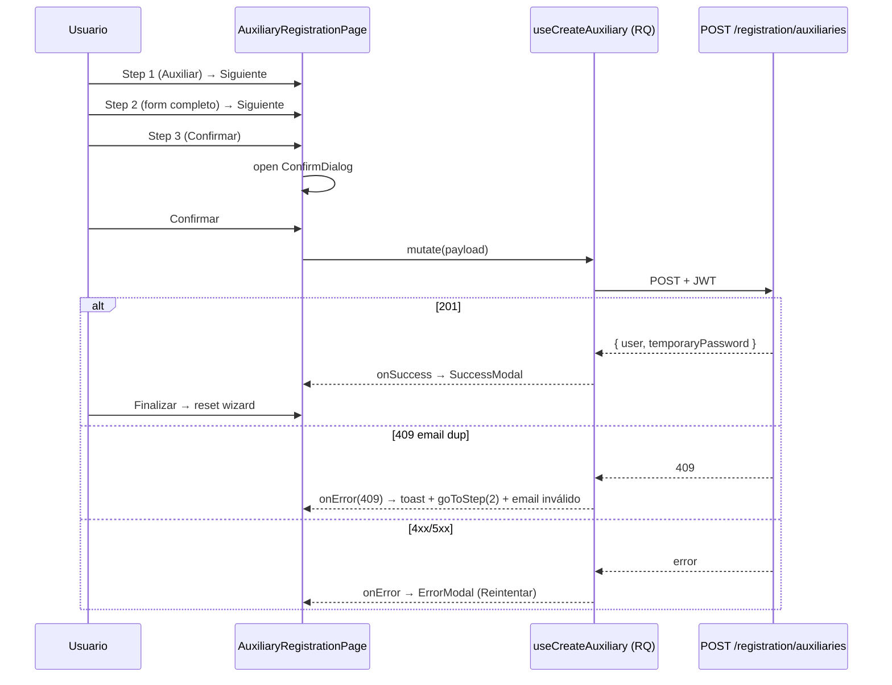

# Design: Add auxiliary registration wizard (FE)

## Technical Approach

Replicar el patrón ya implementado en [pld-web/src/pages/admin/ReportingEntityRegistrationPage.tsx](../../../pld-web/src/pages/admin/ReportingEntityRegistrationPage.tsx): página única con `<Wizard steps>`, schemas Zod por step, services axios + React Query mutation, modales `SuccessFinalizeModal` + `ErrorFinalizeModal` ya existentes (reusables casi 1:1). Estado del wizard en el `state` interno del componente Wizard (no Zustand global), porque la spec exige NO persistir entre sesiones — el state vive durante la vida del componente y se resetea al `Finalizar`.

## Architecture Decisions

### Decision: Páginas en `pages/` (NO `features/`)

**Choice**: `pld-web/src/pages/users/AuxiliaryRegistrationPage.tsx`. La carpeta `features/` no existe en el repo; la convención es `pages/<area>/<Page>.tsx` con organismos en `components/organisms/`.
**Alternativas**: crear `features/` ad-hoc (rechazada — quiebra convención).
**Rationale**: consistencia con `ReportingEntityRegistrationPage.tsx`.

### Decision: Validación con Zod (no Yup)

**Choice**: Zod v4 (ya usado en `components/organisms/reporting-entity/schemas.ts`).
**Alternativas**: Yup (rechazada — no instalado).
**Rationale**: stack real difiere del proposal; alineamos con lo que existe.

### Decision: Estado en Wizard interno, sin Zustand

**Choice**: usar el componente `<Wizard>` existente que ya maneja `state`/`setState` por step. La página solo guarda flags efímeros (`successModal`, `errorModal`, `confirmOpen`).
**Alternativas**: store Zustand (rechazada — overkill, contradice "no persistir").
**Rationale**: el wizard de reporting-entity hace exactamente esto y funciona. Refresh resetea el state automáticamente (cumple INV-15).

### Decision: Reusar `SuccessFinalizeModal` + `ErrorFinalizeModal`

**Choice**: importar `SuccessFinalizeModal` (password copiable + check verde + finalizar) y `ErrorFinalizeModal` (cancelar + reintentar) tal como están.
**Alternativas**: clonarlos (rechazada — duplicación).
**Rationale**: ya cumplen INV-12, INV-13. Si necesitamos botón "Reenviar correo" disabled (no presente hoy), agregar prop opcional `showResendButton?: boolean`.

### Decision: Catálogos vía `catalogsService`

**Choice**: usar [pld-web/src/services/catalogsService.ts](../../../pld-web/src/services/catalogsService.ts) — `getFederalEntities()`, `getAdministrativeEntries(countryCode, level, parentCode)` para municipio/colonia. Wrapper React Query en `queries/catalogsQueries.ts` ya existente.
**Alternativas**: hardcodear estados MX (rechazada — el catálogo ya existe).
**Rationale**: reuso 100%; el wizard de reporting-entity usa la misma fuente.

### Decision: Acceso autenticado vía `RoleProtectedRoute`

**Choice**: `<RoleProtectedRoute requiredRoles={[NOTARY, REAL_ESTATE]}>`. El componente ya redirige a `/` si no matchea (cumple INV-1).
**Alternativas**: guard nuevo (rechazada — ya existe).
**Rationale**: reuso 1:1.

### Decision: Punto de entrada al wizard

**Choice**: pendiente. No hay dashboard distinta para NOTARY/REAL_ESTATE en el repo actual (`AuthenticatedLayout` muestra todos un home común). **Action**: agregar botón "Crear usuario auxiliar" en `pages/users/CreateUserPage.tsx` (la pantalla "Crear usuario") solo si el role es NOTARY/REAL_ESTATE.
**Alternativas**: navegación directa por URL únicamente (rechazada — pésima UX).
**Rationale**: minimiza scope; queda como TODO refinable.

## Data Flow

    /auxiliary/register
      └── RoleProtectedRoute(NOTARY|REAL_ESTATE)
          └── AuxiliaryRegistrationPage
              ├── Wizard<AuxiliaryState>
              │     ├── Step 1: UserTypeStep   (Auxiliar | Clientes → ComingSoon)
              │     ├── Step 2: UserDataStep   (form + zodSchema + catálogos)
              │     └── Step 3: ReviewStep     (read-only + edit-pencil → goToStep)
              ├── ConfirmDialog ("¿Estás seguro/a?")
              ├── SuccessFinalizeModal (al 201)
              └── ErrorFinalizeModal   (al 4xx/5xx no-409)
                          │
                  React Query mutation
                          │
                axiosInstance (Authorization auto)
                          │
            POST /pld-api/auth-users/registration/auxiliaries



## File Changes

| File | Action | Description |
|------|--------|-------------|
| `pld-web/src/pages/users/AuxiliaryRegistrationPage.tsx` | Create | Página con Wizard + modales. |
| `pld-web/src/components/organisms/auxiliary/UserTypeStep.tsx` | Create | Radios + ComingSoonPlaceholder. |
| `pld-web/src/components/organisms/auxiliary/UserDataStep.tsx` | Create | Form RHF + Zod + catálogos. |
| `pld-web/src/components/organisms/auxiliary/ReviewStep.tsx` | Create | Read-only + lápiz. |
| `pld-web/src/components/organisms/auxiliary/schemas.ts` | Create | Zod schemas (`userTypeSchema`, `userDataSchema`). |
| `pld-web/src/services/auxiliariesService.ts` | Create | `createAuxiliary(payload)` axios. |
| `pld-web/src/queries/auxiliariesQueries.ts` | Create | `useCreateAuxiliary()` mutation. |
| `pld-web/src/types/auxiliary.ts` | Create | `AuxiliaryRegistrationPayload`, `AuxiliaryRegistrationResponse` (mirror BE). |
| `pld-web/src/routes/routes-urls.ts` | Modify | `AUXILIARY_REGISTER: "/auxiliary/register"`. |
| `pld-web/src/routes/index.tsx` | Modify | Registrar la ruta protegida. |
| `pld-web/src/pages/users/CreateUserPage.tsx` | Modify | Botón de entrada visible para NOTARY/REAL_ESTATE. |
| `pld-web/src/components/organisms/reporting-entity/SuccessFinalizeModal/index.tsx` | (opcional) Modify | Prop `showResendButton` para mostrar "Reenviar correo" disabled. |

## Interfaces / Contracts

```ts
// types/auxiliary.ts — mirror del DTO BE (mantener sincronizado con
// pld-api/libs/auth-profiles/src/lib/auth-profiles.types.ts:AuxiliaryRegistration).
export interface AuxiliaryRegistrationPayload {
  firstName: string;
  paternalSurname: string;
  maternalSurname: string;
  rfc: string;
  phone: string;
  email: string;
  address: {
    state: string;
    postalCode: string;
    municipality: string;
    neighborhood: string;
    street: string;
    exteriorNumber: string;
    interiorNumber?: string;
  };
}

export interface AuxiliaryRegistrationResponse {
  user: { id: string; email: string; firstName: string; /* ... */ };
  temporaryPassword: string;
}
```

**Errores → UX**:
- 201 → SuccessFinalizeModal.
- 409 → toast "Email ya registrado" + goToStep(2) con `email` marcado inválido.
- 400/4xx-otros/5xx → ErrorFinalizeModal con "Intentar de nuevo".
- 401/403 → ya cubierto por `RoleProtectedRoute` (redirect).

## Testing Strategy

| Layer | What | Approach |
|-------|------|----------|
| Manual smoke | 17 invariants del spec | `yarn dev` + stack BE up + script de Playwright opcional |
| Build | `tsc -b && vite build` | parte del CI mental |

No hay vitest/playwright configurados en el proyecto; smokes manuales bastan.

## Migration / Rollout

No requerida. Feature aditiva, sin breaking de rutas existentes.

## Open Questions

- [ ] **`showResendButton`**: ¿modificar `SuccessFinalizeModal` para mostrar botón "Reenviar correo" disabled, o simplemente omitirlo en este wizard? Mi propuesta: agregar prop opcional. Sin bloqueo.
- [ ] **Punto de entrada UX**: ubicación exacta del botón "Crear usuario auxiliar" en la dashboard. Propuesta: dentro de `CreateUserPage`. Confirmar al implementar.
