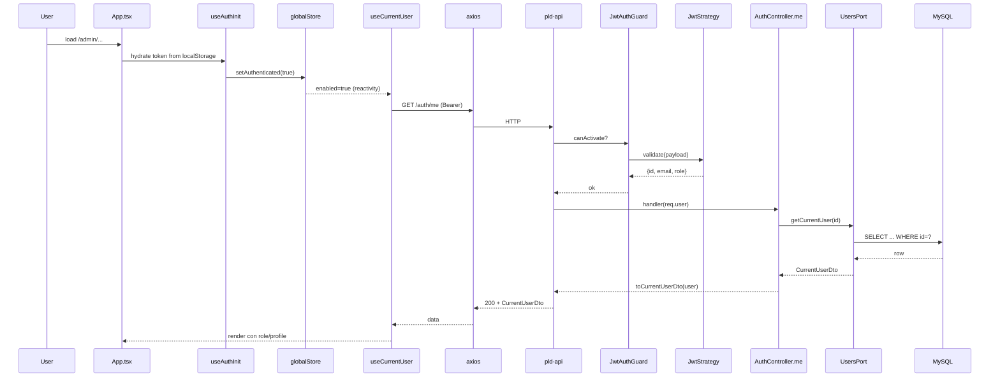
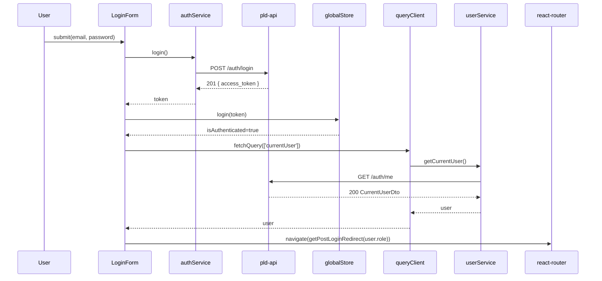

# Design: Add `GET /auth/me` endpoint and adopt it in the web

Documenta las decisiones técnicas. BE y Web. Cada sección referencia el ID de decisión (D1..D17) acordado con el user.

## Contrato API

### `GET /auth/me`

Request:

```
GET /pld-api/auth-users/auth/me HTTP/1.1
Authorization: Bearer <jwt>
```

Response 200:

```ts
type CurrentUserDto = {
  id: string;            // uuid
  email: string;
  role: 'SUPERADMIN' | 'NOTARIO' | 'INMOBILIARIA' | 'AUXILIAR';
  nombre: string;
  apellidoPaterno: string | null;
  apellidoMaterno: string | null;
  telefono: string | null;
  activo: boolean;
  profileType: 'PERSONA_FISICA' | 'PERSONA_MORAL' | null;
  profileId: string | null;        // uuid o null
  lastLoginAt: string | null;      // ISO 8601
  mustChangePassword: boolean;
};
```

Response headers (todas las respuestas 200):

```
Cache-Control: private, no-store
```

Errores:
- `401 Unauthorized` — JWT ausente, inválido, expirado, usuario no encontrado en DB, o `activo === false`. Shape estándar de NestJS `UnauthorizedException` (`{ statusCode: 401, message: 'Unauthorized', error: 'Unauthorized' }`).

## Decisiones BE

### D1 — Ruta `/auth/me` (no `/users/me`)

**Choice**: agregar el endpoint en `AuthController` (`pld-api/apps/auth-users/src/auth/auth.controller.ts`) como `GET /auth/me`.
**Alternatives**: `GET /users/me` en `UsersController`.
**Rationale**: `UsersController` está montado bajo `system-users` y modela CRUD administrativo, no contexto de sesión. `/auth/me` es la convención estándar para "yo logueado" y mantiene la cohesión: `AuthController` ya posee `JwtAuthGuard` y `JwtStrategy`.

### D2 — Guard + decorator existentes

**Choice**: `@UseGuards(JwtAuthGuard)` + `@CurrentUser() user: { id, email, role }` ya provistos por `pld-api/apps/auth-users/src/shared/auth/current-user.decorator.ts` y `JwtStrategy.validate()`.
**Alternatives**: parsear `Authorization` header a mano.
**Rationale**: reutilizar piezas validadas por la app. Ningún cambio de infraestructura.

### D3 — Lookup DB + chequeos defensivos

**Choice**: el handler llama `usersPort.getCurrentUser(req.user.id)` (método NUEVO en el port, distinto de `getUserById` que se mantiene intacto retornando `UserEntity` para no romper consumers internos existentes). Si retorna `null` o `activo === false` → `throw new UnauthorizedException()`. Soft-delete ya queda excluido por TypeORM (no hace falta filtro extra).
**Alternatives**: `NotFoundException` si no existe el usuario; `ForbiddenException` si está inactivo.
**Rationale**: cualquiera de esos casos significa "este JWT ya no representa una sesión válida"; el cliente debe tratarlos igual (logout). Un único 401 simplifica el interceptor del FE.

### D4 — Mapping a DTO

**Choice**: función `toCurrentUserDto(user: UserEntity): CurrentUserDto` en `pld-api/packages/domain-auth-users/src/adapters/users.adapter.ts`. Excluye `passwordHash`, `createdAt`, `updatedAt`, `deletedAt`.
**Alternatives**: usar `class-transformer` con `@Exclude` en la entity.
**Rationale**: el resto de la codebase ya hace mapping manual en adapters; no introducimos `class-transformer` solo para esto. Función pura, fácil de testear.

### D5 — Lookup DB vs JWT-only

**Choice**: ir a la DB siempre.
**Alternatives**: leer todo del payload del JWT.
**Rationale**: el payload solo contiene `{sub, email, role}`. Necesitamos `nombre`, apellidos, `telefono`, `profileType`, `profileId`, `lastLoginAt`, `mustChangePassword`. Además el JWT puede quedar desactualizado (admin desactiva un usuario sin invalidar tokens emitidos). DB es source of truth.

### D6 — Cache headers

**Choice**: `Cache-Control: private, no-store` en cada 200.
**Alternatives**: dejar headers default; usar `private, max-age=0`.
**Rationale**: identidad nunca debe quedar cacheada por proxies o por el navegador. `no-store` es la garantía más fuerte y barata.

### D7 — Migración `must_change_password`

**Choice**: nueva migración TypeORM (timestamp siguiente al último archivo en `pld-api/packages/persistence/migrations/`). Estrategia de dos pasos en un solo `up()`:

```sql
ALTER TABLE users ADD COLUMN must_change_password BOOLEAN NOT NULL DEFAULT false;
UPDATE users SET must_change_password = false; -- idempotente, explícito
ALTER TABLE users ALTER COLUMN must_change_password SET DEFAULT true;
```

`down()`:

```sql
ALTER TABLE users DROP COLUMN must_change_password;
```

**Alternatives**: agregar la columna directamente con `DEFAULT true` y luego un `UPDATE` para todas las filas existentes seteándolas en `false`.
**Rationale**: agregar con `DEFAULT false` evita que cualquier fila preexistente nazca mal en el momento del `ALTER` (MySQL escribe el default en cada row al agregar la columna `NOT NULL`). Después rotamos el default a `true` para que **futuras inserciones** sin valor explícito caigan en `true`. El `UPDATE` intermedio es redundante pero explícito (defensa contra el caso de que un default previo haya quedado seteado por error). Quien lea la migración entiende la intención.

### D8 — Set explícito en alta de usuario

**Choice**: `UsersAdapter.createUser()` (consumido por `POST /system-users/*`) setea `must_change_password = true` en el insert de la entity.
**Alternatives**: confiar en el default `true` post-migración.
**Rationale**: ser explícito en código es robusto frente a futuros cambios de default. Además mantiene la columna trazable desde el adapter sin asumir DDL.

### D9 — `lastLoginAt` bump

**Choice**: en `AuthAdapter.login()`, después de `verifyCredentials()` OK y **antes** de `issueToken()`, llamar `usersPort.touchLastLogin(userId)` (nuevo método del port). El adapter ejecuta `UPDATE users SET last_login_at = NOW() WHERE id = :id`.
**Alternatives**: meter el `UPDATE` dentro de `verifyCredentials`.
**Rationale**: `verifyCredentials` es read-only por contrato (recibe email+password, devuelve userId o null). Mezclar write rompe la separación. Un método nuevo `touchLastLogin` en el port lo deja explícito.

### D10 — `lastLoginAt` fire-and-forget

**Choice**: la ejecución de `touchLastLogin` NO bloquea el login. Si falla, se loguea el error y se igual emite el token.
**Alternatives**: envolver `touchLastLogin` + `issueToken` en una transacción; fallar el login si el `UPDATE` falla.
**Rationale**: `issueToken` solo firma un JWT en memoria, no toca DB. Una transacción no aporta atomicidad real. Y un fallo del `UPDATE` (lock, timeout) no debe impedir que un usuario válido entre — el `lastLoginAt` es métrica, no security boundary.

## Decisiones FE

### D11 — `useCurrentUser` con React Query

**Choice**:

```ts
useQuery({
  queryKey: ['currentUser'],
  queryFn: userService.getCurrentUser,
  enabled: hasToken,
  staleTime: Infinity,
  gcTime: Infinity,
});
```

**Alternatives**: guardar el resultado en Zustand globalStore.
**Rationale**: regla del workspace: server state en React Query, client state en Zustand. `staleTime: Infinity` evita refetch silencioso; el cache se invalida explícitamente en logout (D15).

### D12 — `enabled` desde el store

**Choice**: `enabled = useGlobalStore(s => s.isAuthenticated)`.
**Alternatives**: `enabled = !!localStorage.getItem(LOCAL_STORAGE_KEYS.AUTH_TOKEN)` dentro del hook.
**Rationale**: `localStorage` no es reactivo a cambios de estado de React; el store sí. Mantiene la query enganchada al ciclo de auth y evita renders desincronizados.

### D13 — Login flow

```
1. const token = await authService.login({ email, password });   // mutateAsync
2. globalStore.login(token);                                      // isAuthenticated=true → habilita la query
3. const user = await queryClient.fetchQuery({ queryKey: ['currentUser'], queryFn: userService.getCurrentUser });
4. await navigate(getPostLoginRedirect(user.role));
```

Si el step 3 lanza:
- toast de error,
- `globalStore.logout()` (limpia token),
- el botón vuelve a estado idle.

**Rationale**: `fetchQuery` puebla el cache antes de navegar, así `RoleProtectedRoute` ya tiene el dato apenas montea. Sin `fetchQuery` habría un render con `isLoading=true` que sería interpretado como "no autorizado".

### D14 — Loading de `RoleProtectedRoute`

**Choice**: `<div>Cargando...</div>` mientras `useCurrentUser` está en `isLoading`.
**Alternatives**: spinner global; `null`.
**Rationale**: matchear el estilo de `ProtectedRoute` que ya existe. Keep it boring.

### D15 — Logout invalida cache

**Choice**: nuevo hook `useLogout()` que combina `globalStore.logout()` + `queryClient.removeQueries({ queryKey: ['currentUser'] })`. Reemplaza llamadas directas a `store.logout()` desde componentes.
**Alternatives**: pasar `queryClient` a `globalStore.logout()`.
**Rationale**: el store no debe conocer React Query (capa de abstracción equivocada). Un hook es el lugar natural para combinar ambos.

### D16 — Interceptor 401 limpia cache

**Choice**: `pld-web/src/config/axios.ts` ya hace `removeItem(token)` + redirect en 401. Ampliar para que también llame al helper de logout (que limpia el store y `queryClient.clear()` o el `removeQueries(['currentUser'])`).
**Alternatives**: manejar el 401 en cada hook.
**Rationale**: una sola fuente para "el server me dijo 401". El interceptor importa una función `forceLogout(queryClient)` desde un módulo nuevo `pld-web/src/lib/forceLogout.ts`; el `queryClient` se inyecta al boot via setter (no ciclos de import).

### D17 — Tipos

**Choice**: nuevo `pld-web/src/types/CurrentUser.ts` con la shape de `CurrentUserDto`. Reutilizar el enum existente `pld-web/src/types/UserRole.ts`.
**Alternatives**: extender `User.ts` actual.
**Rationale**: la shape de `/auth/me` es específica del endpoint. Mejor un type dedicado y stable que mutar uno general.

## Diagramas de secuencia

### App boot con token presente



### Login flow



## Alternativas explícitamente descartadas

| Alternativa | Por qué se descarta |
|---|---|
| Decodificar JWT en el FE (estado actual con `jwt-decode`) | Requerimiento explícito del user: el BE debe ser dueño de la identidad. |
| Mantener decode JWT **y** agregar `/auth/me` como "double check" | Redundante: dos fuentes de verdad para lo mismo, riesgo de divergencia. |
| Devolver `passwordHash` enmascarado en el DTO | Nunca exponer el hash, ni siquiera enmascarado. |
| Guardar `currentUser` en Zustand globalStore | Server state pertenece a React Query (regla del workspace). Zustand queda solo para `isAuthenticated` y otros flags client-only. |
| `lastLoginAt` dentro de `verifyCredentials` | Mezcla read y write en un método semánticamente read-only. |

## File changes

| File | Action | Description |
|---|---|---|
| `pld-api/apps/auth-users/src/auth/auth.controller.ts` | Modify | Añade `GET /auth/me` con `JwtAuthGuard` + `@CurrentUser`. |
| `pld-api/packages/domain-auth-users/src/ports/users.port.ts` | Modify | Agrega `getCurrentUser(id)` (DTO público) y `touchLastLogin(id)`. `getUserById` queda intacto. |
| `pld-api/packages/domain-auth-users/src/adapters/users.adapter.ts` | Modify | Implementa los nuevos métodos del port + `toCurrentUserDto`; setea `mustChangePassword=true` en `createUser`. |
| `pld-api/packages/domain-auth-users/src/adapters/auth.adapter.ts` | Modify | Llama `touchLastLogin` antes de `issueToken`. |
| `pld-api/packages/domain-auth-users/src/entities/user.entity.ts` | Modify | Columna `mustChangePassword` (BOOLEAN, NOT NULL, default `true`). |
| `pld-api/packages/persistence/migrations/{ts}-add-must-change-password.ts` | Create | Migración descrita en D7. |
| `pld-web/src/services/userService.ts` | Create | `getCurrentUser(): Promise<CurrentUser>` → `axios.get('/auth/me')`. |
| `pld-web/src/queries/userQueries.ts` | Create | `useCurrentUser` (D11). |
| `pld-web/src/types/CurrentUser.ts` | Create | Type del DTO. |
| `pld-web/src/hooks/useLogout.ts` | Create | Combina store + cache invalidation (D15). |
| `pld-web/src/lib/forceLogout.ts` | Create | Helper para el interceptor (D16). |
| `pld-web/src/config/axios.ts` | Modify | 401 → `forceLogout(queryClient)`. |
| `pld-web/src/routes/RoleProtectedRoute.tsx` | Modify | Lee role/loading desde `useCurrentUser`. |
| `pld-web/src/components/auth/LoginForm/index.tsx` | Modify | Flow de D13. |
| `pld-web/src/store/globalStore.ts` | Modify | Quita decoded JWT claims, deja `isAuthenticated` + token. |
| `pld-web/src/hooks/useCurrentUserRole.ts` | Delete | Reemplazado por `useCurrentUser`. |
| `pld-web/package.json` | Modify | Remueve `jwt-decode`. |

## Risks

| Risk | Impact | Mitigation |
|---|---|---|
| Migración aplica `NOT NULL` con muchas filas existentes en MySQL | Medio | El `DEFAULT false` inicial garantiza valor en cada row durante el `ALTER`; el cambio a `DEFAULT true` posterior no toca filas existentes. |
| `LoginForm` queda colgado si `/auth/me` falla | Medio | D13: catch → toast + `logout()` + reset botón. |
| Interceptor 401 + `useLogout` con ciclo de imports | Bajo | `forceLogout` en módulo separado; `queryClient` se setea por boot via setter, no import directo. |
| `touchLastLogin` falla y rompe login | Bajo | D10: fire-and-forget con log. |
| `nx run cross:build` rompe por el cambio en `users.port.ts` | Bajo | Apps que no consumen `getUserById`/`touchLastLogin` no se ven afectadas; verificar con build tras cada fase. |

## Open questions

- ¿`forceLogout` debería hacer `queryClient.clear()` (limpia toda la cache) o solo `removeQueries(['currentUser'])`? Default propuesto: solo `currentUser`, decidir durante implementación si hay otras keys con datos sensibles.
- ¿Mostrar toast en el caso `mustChangePassword === true` a futuro? Out of scope de este change — el endpoint ya devuelve el flag.
