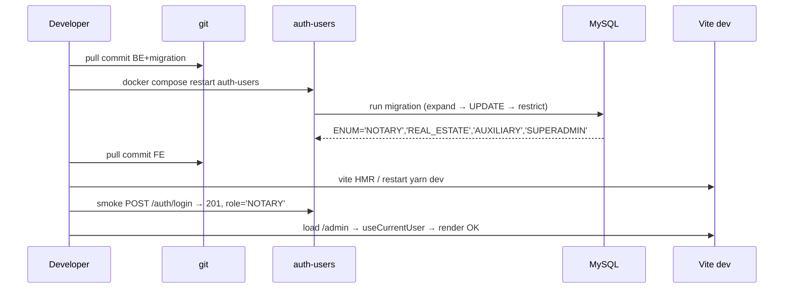
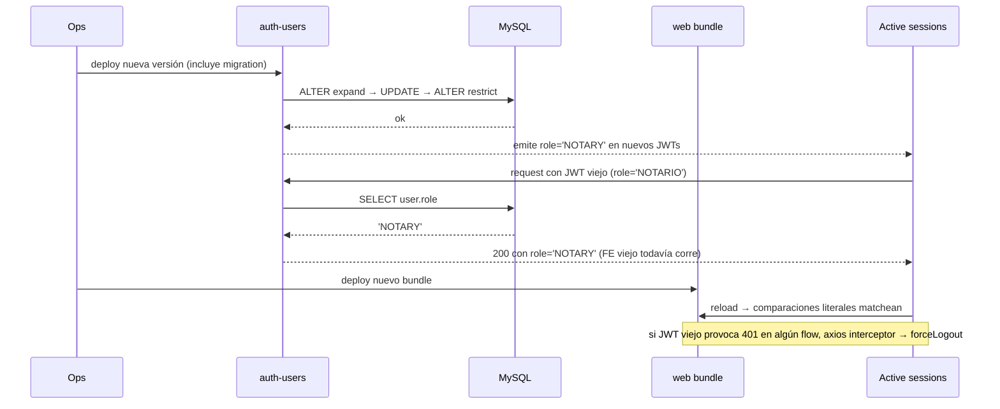

# Design: Rename shared enums to English (names + values)

Documenta cómo se ejecuta el rename atómico y cross-repo de los 8 enums compartidos. Cada decisión referencia el ID acordado con el user (D1..D10).

## Approach

Sweep BE → migración DB → sweep FE → builds, **un solo commit por sub-repo**. Sin ventana de dual-support. El equipo del workspace coordina ambos sub-repos en lockstep, así que la atomicidad es viable y los riesgos de despliegue se acotan al modo prod (documentado, no automatizado).

## Decisions

### D1 — Lockstep atómico vs ventana de dual-support

**Choice**: cambio atómico, sin compatibilidad dual.
**Alternatives**: BE acepta `'NOTARIO'` y `'NOTARY'` durante un release; remueve el legacy en un follow-up.
**Rationale**: el workspace coordina BE+FE en commits consecutivos y no hay terceros consumiendo la API. Mantener doble valor agrega validators duplicados, ramas en mappers, y riesgo de quedarse colgado el legacy. La verificación es trivial (`grep` debe dar 0).

### D2 — Migración DB en 3 statements

**Choice**: tres `ALTER`/`UPDATE` en orden estricto:

```sql
-- 1) Expand: ENUM acepta viejos + nuevos
ALTER TABLE `users` MODIFY COLUMN `role` ENUM (
  'SUPERADMIN','NOTARIO','INMOBILIARIA','AUXILIAR',
  'NOTARY','REAL_ESTATE','AUXILIARY'
) NOT NULL;

-- 2) Backfill
UPDATE `users` SET `role` = CASE `role`
  WHEN 'NOTARIO' THEN 'NOTARY'
  WHEN 'INMOBILIARIA' THEN 'REAL_ESTATE'
  WHEN 'AUXILIAR' THEN 'AUXILIARY'
  ELSE `role`
END;

-- 3) Restrict: ENUM solo nuevos
ALTER TABLE `users` MODIFY COLUMN `role` ENUM (
  'SUPERADMIN','NOTARY','REAL_ESTATE','AUXILIARY'
) NOT NULL;
```

`down`: simétrico en orden inverso (expand a unión → backfill a Spanish → restrict a Spanish).

**Alternatives**: un solo `MODIFY` con backfill implícito.
**Rationale**: MySQL rechaza el `MODIFY` si quedan filas con valores fuera del nuevo ENUM. DDL no es transaccional en MySQL — aceptamos la ventana intermedia de ~ms entre los 3 statements (en dev es irrelevante; en prod se cubre con D3).

### D3 — Orden de despliegue prod

**Choice**: deploy BE primero (con migración aplicada), luego FE.
**Alternatives**: FE primero.
**Rationale**: tras la migración, el BE emite valores en inglés; si el FE viejo todavía está corriendo, lo único que recibe son strings nuevos para mostrar (peor caso: comparación literal falla y el wizard se confunde). Lo opuesto — FE nuevo contra BE viejo — produce 400 al validar `IsIn` de `userRole`/`profileType`. Para este equipo es informativo: el rollout real es un commit + restart local.

### D4 — Tablas de registration

**Choice**: la migración `20260421000000-create-registration-schema.sql` crea `registration.profile_type` y `registration.user_role` como `VARCHAR(30)` (no ENUM) y la tabla está vacía en dev. La migración nueva NO altera DDL de registration; **sí incluye** un `UPDATE` defensivo:

```sql
UPDATE `registration` SET `profile_type` = CASE `profile_type`
  WHEN 'PERSONA_FISICA' THEN 'INDIVIDUAL'
  WHEN 'PERSONA_MORAL' THEN 'LEGAL_ENTITY'
  WHEN 'FIDEICOMISO' THEN 'TRUST'
  ELSE `profile_type`
END;

UPDATE `registration` SET `user_role` = CASE `user_role`
  WHEN 'NOTARIO' THEN 'NOTARY'
  WHEN 'INMOBILIARIA' THEN 'REAL_ESTATE'
  WHEN 'AUXILIAR' THEN 'AUXILIARY'
  ELSE `user_role`
END;
```

`vulnerable_activity.activity` (VARCHAR 80): mismo patrón con `CASE` cubriendo los 10 valores.

**Alternatives**: skipear y asumir tabla vacía.
**Rationale**: la columna es VARCHAR (no constrained), el `UPDATE` es idempotente y barato; en prod futura puede haber filas. Nunca dependemos de "está vacía".

### D5 — `TipoPersonaMoral` (out of scope)

**Choice**: el enum local de `pld-api/libs/participants/src/lib/moral/participants.entity.ts` (`mexicana`/`extranjera` lowercase) **NO** se toca.
**Rationale**: pertenece al rename de `participants`, change separado. Documentado para que reviewers no esperen el cambio.

### D6 — `PersonType` FE entra en este change

**Choice**: renombrar `pld-web/src/types/PersonType.ts` valores a inglés:
- `INDIVIDUAL_MEXICAN`, `INDIVIDUAL_FOREIGN`
- `LEGAL_ENTITY_MEXICAN`, `LEGAL_ENTITY_FOREIGN`
- `PUBLIC_ANNEX_7`, `PUBLIC_ANNEX_7_BIS`
- `TRUST_ANNEX_8`

**Alternatives**: diferir a un cleanup FE-only.
**Rationale**: `PersonType` es paralelo semántico a `ProfileType`. Dejarlo en español rompe la coherencia que persigue este change.

### D7 — DTO + Swagger

**Choice**: `CreateRegistrationDto` valida `userRole ∈ {'NOTARY','REAL_ESTATE'}` y `profileType ∈ {'INDIVIDUAL','LEGAL_ENTITY'}`. Swagger `enum` y `example` se actualizan en lockstep. POST con valores viejos → 400.
**Alternatives**: aceptar ambos.
**Rationale**: misma lógica que D1. La verificación incluye un smoke `POST /admin/registration` con valor nuevo (201) y valor viejo (400).

### D8 — Test fixtures

**Choice**: `registration.service.spec.ts:23-24` y cualquier otro `.spec.ts` con literals (`'NOTARIO'`, `TipoPersonaParticipante.PERSONA_FISICA`) se actualizan en el mismo commit.
**Rationale**: `tsc --noEmit` los flagea automáticamente al renombrar en `enums.ts`.

### D9 — Impacto en JWT y `GET /auth/me`

**Choice**: el JWT firmado por `POST /auth/login` lleva `role` con el nuevo valor (`'NOTARY'`); `GET /auth/me` retorna `role: UserRole` y `profileType: 'INDIVIDUAL'|'LEGAL_ENTITY'|null`. Sesiones existentes en navegadores quedan invalidadas el momento que se aplica la migración: el `role` claim del JWT viejo (`'NOTARIO'`) ya no matchea el ENUM de DB cuando el BE rehidrata el user. El interceptor 401 del FE (`pld-web/src/config/axios.ts`) llama `forceLogout` y el user se reloguea.
**Alternatives**: invalidar JWTs explícitamente (rotar secret).
**Rationale**: en prod la inconsistencia es transitoria (los JWTs caducan rápido) y `forceLogout` ya cubre el caso. No vale la pena rotar secrets.

### D10 — Sweep order (un commit por repo)

**Choice**: orden estricto, todo en un solo commit por sub-repo:
1. **pld-api**: `enums.ts` rename → cascade tsc → DTOs/Swagger → test fixtures → migración SQL up/down → `nx run auth-users:build` + `nx run cross:build`.
2. **pld-web**: `types/UserRole.ts`, `types/registration.ts` (renombre a `ProfileType`), `types/CurrentUser.ts`, `types/PersonType.ts` → cascade tsc → schemas zod → wizard literals → `yarn build`.

**Alternatives**: commit por enum.
**Rationale**: `tsc --noEmit` solo cierra cuando todo el grafo está consistente; commits parciales dejarían el repo no-compilable. Un commit atómico es más fácil de revertir.

## Sequence diagram — cutover

### Local dev (rollout real para este equipo)



### Producción (idealizada — fuera de alcance del rollout actual)



## API contract changes

### `POST /auth/login`

| Campo | Antes | Después |
|---|---|---|
| Response 201 body shape | `{ access_token: string }` | igual shape |
| `access_token` claim `role` | `'SUPERADMIN'\|'NOTARIO'\|'INMOBILIARIA'\|'AUXILIAR'` | `'SUPERADMIN'\|'NOTARY'\|'REAL_ESTATE'\|'AUXILIARY'` |

### `GET /auth/me`

| Campo | Antes | Después |
|---|---|---|
| `role` | `'SUPERADMIN'\|'NOTARIO'\|'INMOBILIARIA'\|'AUXILIAR'` | `'SUPERADMIN'\|'NOTARY'\|'REAL_ESTATE'\|'AUXILIARY'` |
| `profileType` | `'PERSONA_FISICA'\|'PERSONA_MORAL'\|null` | `'INDIVIDUAL'\|'LEGAL_ENTITY'\|null` |
| Resto | unchanged | unchanged |

### `POST /admin/registration` (CreateRegistrationDto)

| Campo | Antes | Después |
|---|---|---|
| `userRole` (request) | `IsIn(['NOTARIO','INMOBILIARIA'])` | `IsIn(['NOTARY','REAL_ESTATE'])` |
| `profileType` (request) | `IsIn(['PERSONA_FISICA','PERSONA_MORAL'])` | `IsIn(['INDIVIDUAL','LEGAL_ENTITY'])` |
| Swagger `enum`/`example` | español | inglés |
| 400 trigger | valores fuera | valores viejos producen 400 |

### `POST /system-users/*` (CreateUserDto Swagger only)

| Campo | Antes | Después |
|---|---|---|
| `role` example | `UserRole.NOTARIO` / `UserRole.AUXILIAR` | `UserRole.NOTARY` / `UserRole.AUXILIARY` |

## Reorganization map / file changes

### pld-api

| File | Action | Description |
|---|---|---|
| `pld-api/packages/shared-types/src/enums.ts` | Modify | Renombre de los 7 enums (D1, D6 fuera). `UserRole` valores; `TipoPersonaParticipante`→`ProfileType`; `Nacionalidad`→`Nationality`; `ModalidadAtencion`→`AttendanceMode`; `ActividadVulnerable`→`VulnerableActivity`; `TipoMoneda`→`CurrencyType`; `FormaPago`→`PaymentMethod`; `TipoReporte`→`ReportType`. |
| `pld-api/packages/shared-types/src/participants.ts` | Modify | L40, L103, L178: `TipoPersonaParticipante.*` → `ProfileType.*`. |
| `pld-api/packages/shared-types/src/index.ts` | Modify | Re-exports (verificar). |
| `pld-api/apps/auth-users/src/admin/registration/registration.service.ts` | Modify | L106-111, L180, L198, L209, L226, L329-330, L386, L400, L407: imports y comparisons. Comentario L106 también. |
| `pld-api/apps/auth-users/src/admin/registration/registration.service.spec.ts` | Modify | L23-24: fixture. |
| `pld-api/apps/auth-users/src/admin/registration/registration.adapter.ts` | Modify | L358: `TipoPersonaParticipante.PERSONA_FISICA` → `ProfileType.INDIVIDUAL`. |
| `pld-api/apps/auth-users/src/admin/registration/registration.controller.ts` | Modify | L144 ApiOperation summary. |
| `pld-api/apps/auth-users/src/admin/registration/dto/create-registration.dto.ts` | Modify | L3, L7-9, L11-13, L18-23: import + Swagger + IsIn + messages. |
| `pld-api/apps/auth-users/src/users/dto/create-user.dto.ts` | Modify | L30, L72: Swagger examples. |
| `pld-api/apps/auth-users/src/catalogs/catalogs.data.ts` | Modify | L84: `ActividadVulnerable.FIDEICOMISOS` → `VulnerableActivity.TRUSTS` (verificar valor exacto en spec). |
| `pld-api/libs/auth-profiles/src/lib/auth-profiles.types.ts` | Modify | L22-23: literal union `'AUXILIAR'\|'NOTARIO'\|'INMOBILIARIA'` → inglés. |
| `pld-api/libs/operacion/src/lib/operacion.types.ts` | Modify | Consumers de `ActividadVulnerable`/`TipoMoneda`/`FormaPago`. |
| `pld-api/libs/reports/src/lib/reports.types.ts` | Modify | Consumers de `TipoReporte`/`TipoPersonaParticipante`/`ActividadVulnerable`. |
| `pld-api/packages/persistence/migrations/{ts}-rename-enums-to-english.sql` | Create | 3-step migration en `users.role` (D2) + UPDATE defensivo en `registration.profile_type`, `registration.user_role`, `vulnerable_activity.activity` (D4). |
| `pld-api/packages/persistence/migrations/{ts}-rename-enums-to-english.down.sql` | Create | Reverso simétrico. |

### pld-web

| File | Action | Description |
|---|---|---|
| `pld-web/src/types/UserRole.ts` | Modify | Valores a inglés. |
| `pld-web/src/types/registration.ts` | Modify | Renombre archivo+export a `ProfileType`; valores a `INDIVIDUAL`/`LEGAL_ENTITY`/`TRUST`. |
| `pld-web/src/types/CurrentUser.ts` | Modify | L12: literal union → `'INDIVIDUAL'\|'LEGAL_ENTITY'\|null`. |
| `pld-web/src/types/PersonType.ts` | Modify | D6: 7 valores en inglés. |
| `pld-web/src/components/organisms/reporting-entity/schemas.ts` | Modify | L9, L14-15: zod enums actualizados. |
| `pld-web/src/components/organisms/reporting-entity/ReportingEntityTypeStep/index.tsx` | Modify | L30, L36, L71, L74, L81, L84: literal references. |
| `pld-web/src/components/organisms/reporting-entity/ReviewStep/index.tsx` | Modify | L52, L58, L61: comparaciones literales. |
| `pld-web/src/pages/admin/ReportingEntityRegistrationPage.tsx` | Modify | L30, L125, L137, L169, L264, L359-364: imports + literales. |
| `pld-web/src/components/organisms/external-users/PersonType/index.tsx` | Modify | L80-81: `PersonTypeEnum.FIDEICOMISO_ANEXO8` → `PersonType.TRUST_ANNEX_8`. |
| `pld-web/src/config/postLoginRedirect.ts` | Modify | Comentario L13 + cualquier referencia literal. |

## Risks (expanded)

| Risk | Likelihood | Mitigation |
|---|---|---|
| Request en flight con valores viejos durante migración prod | Med (prod) / Low (dev) | D3 deploy ordering. En dev: restart BE + reload FE; aceptable. |
| `.spec.ts` u otro consumer fuera del audit con string literal | Med | Sweep `grep -r` exhaustivo en `apply` (success criterion del proposal); `tsc --noEmit` flagea identifiers, NO string literals — el grep cubre eso. |
| Entity TypeORM con `enum` column-type apuntando al enum TS renombrado | Low | `users.role` usa string en DDL, no `enum: UserRole` en TypeORM. Verificar leyendo `user.entity.ts`. Si fuera enum-typed, el rename del valor TS rompe metadata; mitigación: forzar `enum: ['SUPERADMIN','NOTARY','REAL_ESTATE','AUXILIARY']` literal en column decorator. |
| Sesiones JWT viejas en navegadores tras migración prod | Med | D9: axios interceptor 401 → `forceLogout`; user se reloguea. |
| Migración aplica `UPDATE` en tabla con muchas filas → lock | Low | Tabla `users` y `registration` son chicas (centenas); MySQL maneja sin downtime perceptible. Si crece, considerar `pt-online-schema-change`. |
| `nx run cross:build` rompe por cambio en `shared-types` | Low | `cross` consume `@pld-api/shared-types`; el rename rompe imports → `tsc` flagea. Smoke `nx run cross:build` antes del commit. |
| Rollback parcial (BE revertido, DB no) | Med | Down-migration explícita y testeada en `apply` con `migration:revert` antes de mergear. |

## Testing strategy

| Layer | What | Approach |
|---|---|---|
| Type-check BE | Renames cubiertos | `pnpm tsc --noEmit` desde root → 0 errors. |
| Type-check FE | Renames cubiertos | `yarn tsc -b` → 0 errors. |
| Build | App targets compilan | `nx run auth-users:build`, `nx run cross:build`, `yarn build`. |
| Migration | Up + down idempotentes | `pnpm migration:run` luego `pnpm migration:revert` luego `pnpm migration:run` en DB local. |
| Smoke E2E (manual) | API contract | `POST /auth/login` con notary user → 201 + JWT con `role:'NOTARY'`. `POST /admin/registration` con `userRole:'NOTARY'`, `profileType:'INDIVIDUAL'` → 201; con `'NOTARIO'` → 400. |
| Grep sweep | 0 hits viejos fuera de migrations | `grep -r "'NOTARIO'\|'PERSONA_FISICA'\|TipoPersonaParticipante\|ActividadVulnerable\|FormaPago\|TipoReporte\|ModalidadAtencion\|Nacionalidad\|TipoMoneda" pld-api/{apps,libs,packages}/*/src pld-web/src` → 0. |

## Open Questions

- [ ] `catalogs.data.ts:84` usa `ActividadVulnerable.FIDEICOMISOS` (plural). El nuevo nombre del valor es `TRUSTS` o `TRUST_AGREEMENTS`? — definir en spec `shared-types` antes de apply.
- [ ] `user.entity.ts` decorator: ¿usa `enum: UserRole` o string literal array? — verificar en apply para evitar el riesgo de la tabla 3.
- [ ] `cross` app: ¿hay consumers de los enums renombrados? — `grep` final antes de commit.
