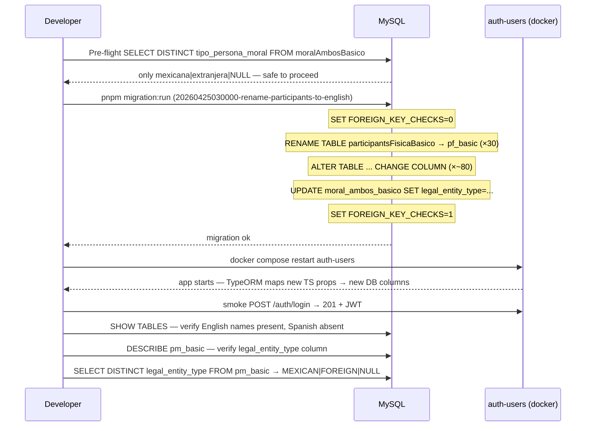

# Design: Rename participants entities + tables + columns to English

BE-only atomic rename of 30 entities, 30 DB tables, ~80 columns, 1 local enum, and all consumers in a single pld-api commit. No dual-support window. TypeORM inferred column naming is the core mechanism — renaming a TS property changes the inferred snake_case column name, so the migration renames DB columns to match.

## Decisions

### D1 — Lockstep single commit

| Option | Tradeoff | Decision |
|--------|----------|----------|
| Single atomic commit | Requires all phases coordinated before commit | ✅ Chosen |
| Split per subfolder | `participants.module.ts` needs 4+ incremental updates; codebase unbuildable between commits | Discarded |

0 FE consumers verified — no cross-repo coordination needed. Single commit on pld-api covers all 30 entities.

### D2 — Migration shape

| Option | Tradeoff | Decision |
|--------|----------|----------|
| Single migration file with FK checks disabled | Atomic, data-preserving, rollback is whole-or-nothing | ✅ Chosen |
| 30 separate migrations | No coordination benefit; rollback must chain all 30 | Discarded |

Shape: `SET FOREIGN_KEY_CHECKS=0` → 30 `RENAME TABLE` → ~80 `ALTER TABLE ... CHANGE COLUMN` → `UPDATE pm_basic SET legal_entity_type = ...` → `SET FOREIGN_KEY_CHECKS=1`. Down mirrors in reverse.

Migration timestamp: `20260425030000` (follows `20260425020000-rename-users-columns-to-english`).

### D3 — Column rename strategy

| Option | Tradeoff | Decision |
|--------|----------|----------|
| Rename DB column to new English snake_case | Clean state; DB matches TS intent | ✅ Chosen |
| Keep Spanish column names + `@Column({ name: 'old' })` | DB inconsistent with rename intent; tech debt | Discarded |

TypeORM infers column names from camelCase property → snake_case. After renaming `apellidoPaterno` → `paternalSurname`, inferred column becomes `paternal_surname`. Migration renames the actual DB column from current `apellido_paterno` to `paternal_surname`.

### D4 — TypeORM inferred columns (no explicit name override)

Most `@Column` decorators in participants entities do NOT have explicit `name:` attributes (confirmed by audit). Exception: columns already using explicit `name:` like `id_participante`, `id_beneficiario_controlador`, `created_at`, `updated_at` — these are left unchanged. For all other columns: rename TS property → TypeORM infers new snake_case → migration renames DB column to match.

**Deploy order**: apply migration first → restart BE. Code and DB must match at the same moment.

### D5 — Module registration of `PFImmigrationDocumentDisplayEntity`

| Option | Tradeoff | Decision |
|--------|----------|----------|
| Add to `forFeature([])` in this change | Closes orphan class; TypeORM will verify table exists post-migration | ✅ Chosen |
| Defer | Leaves unregistered entity; tech debt | Discarded |

The migration must rename `participantsFisicaDocumentoINMPantalla` → `pf_immigration_document_display` before BE restart, or TypeORM will fail on startup.

### D6 — `paisNationality` bug fix

| Option | Tradeoff | Decision |
|--------|----------|----------|
| `paisNationality` → `nationalityCountry` | Fixes mixed Spanish-English name; inferred col `nationality_country` | ✅ Chosen |
| Preserve buggy name | Accumulates tech debt; grep for old identifiers would continue to match | Discarded |

### D7 — Local enum `TipoPersonaMoral` → `LegalEntityType`

| Option | Tradeoff | Decision |
|--------|----------|----------|
| Rename enum + values to uppercase (`MEXICAN`, `FOREIGN`) | Consistent with `UserRole`, `Nationality`, `ProfileType` (all uppercase) | ✅ Chosen |
| Keep lowercase values (`mexicana`, `extranjera`) | Inconsistent with workspace enum convention | Discarded |

Requires data migration `UPDATE moral_ambos_basico SET legal_entity_type = 'MEXICAN' WHERE legal_entity_type = 'mexicana'` (and `FOREIGN`/`extranjera`). Pre-flight: `SELECT DISTINCT tipo_persona_moral FROM moralAmbosBasico` must return only `mexicana|extranjera|NULL`.

Note: `TipoPersonaMoral` also appears in `apps/auth-users/src/participants/persona-fisica/dto/create/persona-fisica.dto.ts` — this duplicate DTO enum must be updated to `LegalEntityType` with uppercase values in the same change.

### D8 — Service class renames

| Option | Tradeoff | Decision |
|--------|----------|----------|
| Rename service classes to English (`ParticipantsIndividualService`, `ParticipantsLegalEntityService`, `TrustService`, `Annex7Service`, `CrossBeneficialOwnerService`) | Closes Spanish class names chapter; DI token update surfaced by tsc | ✅ Chosen |
| Keep Spanish service names | Leaves Spanish identifiers in source tree; grep would flag them | Discarded |

Service class renames require updating `providers:[]`, `exports:[]` in `participants.module.ts` and all injection sites in adapters.

### D9 — Adapter folder names

| Option | Tradeoff | Decision |
|--------|----------|----------|
| Keep `persona-fisica/`, `persona-moral/`, `fideicomiso/`, `anexo-7/` folder names | Scope is libs/participants; folder renames are cosmetic app-layer work | ✅ Chosen |
| Rename folders too | Extends scope substantially; follow-up change | Discarded |

Adapters are updated (imports + service injection) but folder names stay.

### D10 — `CrossBenControladorEntity` inclusion (bonus)

| Option | Tradeoff | Decision |
|--------|----------|----------|
| Include in this change | Last remaining entity with Spanish naming; closes participants chapter completely | ✅ Chosen |
| Defer to separate change | Leaves one Spanish entity after all others renamed | Discarded |

### D11 — DTO property sweep

DTOs pass data as `Partial<EntityType>` — the adapter calls `participantsService.createFisicaPerfilBasico(dto)` where dto is typed against the DTO class, not the entity. The service then maps fields explicitly. This means DTO property names do NOT need to match entity property names to compile. However, `CreateParticipantFisicaBasicoDto` has `nombre`, `apellidoPaterno`, `paisNationality` which are Spanish — these should be renamed to English for consistency and to pass grep cleanliness gate.

**Verdict**: rename DTO properties that mirror entity properties. Keep `@ApiProperty({ description: '...' })` Spanish strings.

## Sequence diagram — migration cutover (local dev)

## Entity rename map

### fisica (11 entities)

| Old class | New class | Old table | New table |
|-----------|-----------|-----------|-----------|
| `ParticipantPFBasicaEntity` | `PFBasicEntity` | `participantsFisicaBasico` | `pf_basic` |
| `ParticipantPFIdentificacionEntity` | `PFIdentificationEntity` | `participantsFisicaIdentificacion` | `pf_identification` |
| `ParticipantPFDomicilioEntity` | `PFAddressEntity` | `participantsFisicaDomicilio` | `pf_address` |
| `ParticipantPFDocumentoINMEntity` | `PFImmigrationDocumentEntity` | `participantsFisicaDocumentoINM` | `pf_immigration_document` |
| `ParticipantPFDomicilioNacionalEntity` | `PFNationalAddressEntity` | `participantsFisicaDomicilioNacional` | `pf_national_address` |
| `ParticipantPFDatosIdentificacionEntity` | `PFIdentificationDataEntity` | `participantsFisicaDatosIdentificacion` | `pf_identification_data` |
| `ParticipantPFDocumentoINMPantallaEntity` | `PFImmigrationDocumentDisplayEntity` | `participantsFisicaDocumentoINMPantalla` | `pf_immigration_document_display` |
| `ParticipantPFBeneficiarioControladorEntity` | `PFBeneficialOwnerEntity` | `participantsFisicaBeneficiarioControlador` | `pf_beneficial_owner` |
| `ParticipantRepresentanteEntity` | `PFLegalRepresentativeEntity` | `participantsFisicaRepresentante` | `pf_legal_representative` |
| `ParticipantRepresentanteDomicilioEntity` | `PFLegalRepresentativeAddressEntity` | `participantsFisicaRepresentanteDomicilio` | `pf_legal_representative_address` |
| `ParticipantRepresentanteIdentificacionEntity` | `PFLegalRepresentativeIdentificationEntity` | `participantsFisicaRepresentanteIdentificacion` | `pf_legal_representative_identification` |

### moral (8 entities)

| Old class | New class | Old table | New table |
|-----------|-----------|-----------|-----------|
| `ParticipantePMBasicoEntity` | `PMBasicEntity` | `moralAmbosBasico` | `pm_basic` |
| `ParticipantePMDomicilioEntity` | `PMAddressEntity` | `moralAmbosDomicilio` | `pm_address` |
| `ParticipantePMRepresentanteEntity` | `PMLegalRepresentativeEntity` | `moralAmbosRepresentante` | `pm_legal_representative` |
| `ParticipantePMIdentificacionRepresentanteEntity` | `PMLegalRepresentativeIdentificationEntity` | `moralAmbosIdentificacionRepresentante` | `pm_legal_representative_identification` |
| `ParticipantePMPEPEntity` | `PMPoliticallyExposedPersonEntity` | `moralMexicanaPEP` | `pm_pep` |
| `ParticipantePMDocumentoMigratorioEntity` | `PMMigratoryDocumentEntity` | `moralExtranjeraDocumentoMigratorio` | `pm_migratory_document` |
| `ParticipantePMDomicilioTerritorialNacionalEntity` | `PMNationalTerritorialAddressEntity` | `moralExtranjeraDomicilioNacional` | `pm_national_territorial_address` |
| `ParticipantePMBeneficiarioControladorEntity` | `PMBeneficialOwnerEntity` | `moralAmbosBenControladorRelacion` | `pm_beneficial_owner` |

### fideicomiso (5 entities)

| Old class | New class | Old table | New table |
|-----------|-----------|-----------|-----------|
| `FideicomisoEntity` | `TrustEntity` | `fideicomisoBasico` | `trust_basic` |
| `ApoderadoDelegadoEntity` | `TrustAuthorizedDelegateEntity` | `fideicomisoApoderadoDelegado` | `trust_authorized_delegate` |
| `IdentificacionEntity` | `TrustIdentificationEntity` | `fideicomisoIdentificacion` | `trust_identification` |
| `BenControladorRelacionEntity` | `TrustBeneficialOwnerEntity` | `fideicomisoBenControladorRelacion` | `trust_beneficial_owner` |
| `PersonaPoliticamenteExpuestaEntity` | `TrustPoliticallyExposedPersonEntity` | `fideicomisoPersonaPoliticamenteExpuesta` | `trust_pep` |

### anexo-7 (5 entities)

| Old class | New class | Old table | New table |
|-----------|-----------|-----------|-----------|
| `Anexo7OBisBasicoEntity` | `Annex7BasicEntity` | `anexo_7_o_bis_basico` | `annex7_basic` |
| `Anexo7DomicilioEntity` | `Annex7AddressEntity` | `anexo_7_domicilio` | `annex7_address` |
| `Anexo7RepresentanteLegalEntity` | `Annex7LegalRepresentativeEntity` | `anexo_7_representante_legal` | `annex7_legal_representative` |
| `Anexo7IdentificacionEntity` | `Annex7IdentificationEntity` | `anexo_7_identificacion` | `annex7_identification` |
| `Anexo7FuncionarioEntity` | `Annex7OfficialEntity` | `anexo_7_funcionario` | `annex7_official` |

### beneficiario-controlador (1 entity)

| Old class | New class | Old table | New table |
|-----------|-----------|-----------|-----------|
| `CrossBenControladorEntity` | `CrossBeneficialOwnerEntity` | `crossBeneficiarioControlador` | `cross_beneficial_owner` |

## Key column renames (non-obvious)

| Table | Old column | New column | Notes |
|-------|-----------|-----------|-------|
| `pf_basic` | `pais_nationality` | `nationality_country` | Bug fix: was `paisNationality` mixed name |
| `pm_basic` | `tipo_persona_moral` | `legal_entity_type` | Enum rename |
| `pm_basic` | `pais_nacionalidad` | `nationality_country` | |
| `pm_basic` | `objeto_social_giro` | `business_activity` | |
| `pm_basic` | `denominacion_razon_social` | `legal_name` | |
| `pm_basic` | `fecha_constitucion` | `incorporation_date` | |
| `trust_authorized_delegate` / `trust_identification` / `trust_beneficial_owner` / `trust_pep` | `id_participante` (as `uid`) | no rename — explicit `name: 'id_participante'` already set | Verify during apply |
| `cross_beneficial_owner` | `tipo_usuario` | `participant_type` | |
| `cross_beneficial_owner` | `apellido_paterno` | `paternal_surname` | |
| `cross_beneficial_owner` | `apellido_materno` | `maternal_surname` | |
| `cross_beneficial_owner` | `lugar_nacimiento` | `birthplace` | |
| `cross_beneficial_owner` | `ocupacion_profesion` | `occupation` | |
| `cross_beneficial_owner` | `correo_electronico` | `email` | |
| `cross_beneficial_owner` | `tipo_domicilio` | `address_type` | |
| `cross_beneficial_owner` | `numero_exterior` | `exterior_number` | |
| `cross_beneficial_owner` | `numero_interior` | `interior_number` | |
| `cross_beneficial_owner` | `codigo_postal` | `postal_code` | |
| `cross_beneficial_owner` | `nombre_documento` | `document_name` | |
| `cross_beneficial_owner` | `numero_documento` | `document_number` | |
| `cross_beneficial_owner` | `autoridad_emite` | `issuing_authority` | |
| `cross_beneficial_owner` | `ejerce_derechos` | `exercises_rights` | |
| `cross_beneficial_owner` | `cargo_ejerce_derechos` | `rights_position` | |
| `cross_beneficial_owner` | `tiene_parentesco` | `has_family_relation` | |
| `cross_beneficial_owner` | `cargo_parentesco` | `family_relation_position` | |
| `cross_beneficial_owner` | `nombre_completo_pep` | `pep_full_name` | |

## Service renames

| Old class | New class | File |
|-----------|-----------|------|
| `ParticipantsFisicaService` | `ParticipantsIndividualService` | `libs/participants/src/lib/fisica/participants.service.ts` |
| `ParticipantsMoralService` | `ParticipantsLegalEntityService` | `libs/participants/src/lib/moral/participants.service.ts` |
| `FideicomisoService` | `TrustService` | `libs/participants/src/lib/fideicomiso/participants.service.ts` |
| `Anexo7Service` | `Annex7Service` | `libs/participants/src/lib/anexo-7/anexo-7.service.ts` |
| `BenControladorService` | `CrossBeneficialOwnerService` | `libs/participants/src/lib/beneficiario-controlador/ben-controlador.service.ts` |

## Sweep order (within single commit)

1. Entity files: class names + `@Entity({ name: })` + TS property names (no explicit `@Column({ name: })` added)
2. Local enum in `moral/participants.entity.ts`: `TipoPersonaMoral` → `LegalEntityType`, values lowercase → uppercase
3. `participants.module.ts`: all imports + `forFeature([])` (add `PFImmigrationDocumentDisplayEntity`)
4. Each `participants.service.ts` / `ben-controlador.service.ts`: class names + repository injections
5. `libs/participants/src/index.ts`: re-exports to new service class names
6. App adapters: `apps/auth-users/src/participants/{persona-fisica,persona-moral,fideicomiso,anexo-7}/...adapter.ts` + `apps/cross/src/beneficiario-controlador/ben-controlador.adapter.ts`
7. DTO sweep: `apps/auth-users/src/participants/**/dto/**/*.ts` — rename Spanish property names; update `TipoPersonaMoral` enum reference to `LegalEntityType`
8. Migration file: `packages/persistence/migrations/20260425030000-rename-participants-to-english.sql` + `.down.sql`
9. Build gate: `pnpm tsc --noEmit` (libs/participants) → `nx run auth-users:build` → `nx run cross:build`
10. `pnpm migration:run` → restart auth-users → smoke `POST /auth/login` 201

## File changes

### pld-api

| File | Action | Notes |
|------|--------|-------|
| `libs/participants/src/lib/fisica/participants.entity.ts` | Modify | 11 class renames + all TS property renames; `paisNationality` → `nationalityCountry` |
| `libs/participants/src/lib/moral/participants.entity.ts` | Modify | 8 class renames + props; `TipoPersonaMoral` → `LegalEntityType` enum |
| `libs/participants/src/lib/fideicomiso/participants.entity.ts` | Modify | 5 class renames + props |
| `libs/participants/src/lib/anexo-7/anexo-7.entity.ts` | Modify | 5 class renames + props |
| `libs/participants/src/lib/beneficiario-controlador/ben-controlador.entity.ts` | Modify | 1 class rename + ~25 prop renames |
| `libs/participants/src/lib/participants.module.ts` | Modify | All import renames; add `PFImmigrationDocumentDisplayEntity`; rename service class references |
| `libs/participants/src/lib/fisica/participants.service.ts` | Modify | Class → `ParticipantsIndividualService`; repository injection types updated |
| `libs/participants/src/lib/moral/participants.service.ts` | Modify | Class → `ParticipantsLegalEntityService`; repo types updated; explicit prop refs updated |
| `libs/participants/src/lib/fideicomiso/participants.service.ts` | Modify | Class → `TrustService`; repo types updated |
| `libs/participants/src/lib/anexo-7/anexo-7.service.ts` | Modify | Class → `Annex7Service`; repo types updated |
| `libs/participants/src/lib/beneficiario-controlador/ben-controlador.service.ts` | Modify | Class → `CrossBeneficialOwnerService`; entity type updated |
| `libs/participants/src/index.ts` | Modify | Re-exports updated to new service class names |
| `apps/auth-users/src/participants/persona-fisica/participants.adapter.ts` | Modify | Import `ParticipantsIndividualService`; constructor type updated |
| `apps/auth-users/src/participants/persona-moral/participant.adapter.ts` | Modify | Import `ParticipantsLegalEntityService`; constructor type updated |
| `apps/auth-users/src/participants/fideicomiso/fideicomiso.adapter.ts` | Modify | Import `TrustService`; constructor type updated |
| `apps/auth-users/src/participants/anexo-7/anexo-7.adapter.ts` | Modify | Import `Annex7Service`; constructor type updated |
| `apps/cross/src/beneficiario-controlador/ben-controlador.adapter.ts` | Modify | Import `CrossBeneficialOwnerService` |
| `apps/auth-users/src/participants/persona-fisica/dto/create/persona-fisica.dto.ts` | Modify | Rename Spanish props + `TipoPersonaMoral` enum ref → `LegalEntityType` |
| `apps/auth-users/src/participants/persona-moral/dto/create/persona-moral.dto.ts` | Modify | Rename Spanish props if any mirror entity props |
| `packages/persistence/migrations/20260425030000-rename-participants-to-english.sql` | Create | 30 RENAME TABLE + ~80 CHANGE COLUMN + enum UPDATE |
| `packages/persistence/migrations/20260425030000-rename-participants-to-english.down.sql` | Create | Reverse of above |

## Testing strategy

| Layer | What | Approach |
|-------|------|----------|
| Type-check | All TS renames consistent | `pnpm tsc --noEmit` from `pld-api` root → 0 errors |
| Build | App targets compile | `nx run auth-users:build`, `nx run cross:build` → exit 0 |
| Migration | Up idempotent | `pnpm migration:run` on local DB → 0 errors |
| DB state | Table + column names | `SHOW TABLES` shows English names; `DESCRIBE pm_basic` shows `legal_entity_type` not `tipo_persona_moral` |
| Enum data | Values migrated | `SELECT DISTINCT legal_entity_type FROM pm_basic` → `MEXICAN\|FOREIGN\|NULL` only |
| Smoke | API works | `POST /auth/login` → 201 + JWT |
| Grep | 0 old identifiers | `grep -r 'ParticipantPF\|ParticipantePM\|Fideicomiso[^C]\|Anexo7O\|ApoderadoDelegado\|BenControladorRelacion\|PersonaPoliticamenteExpuesta\|CrossBenControlador\|paisNationality\|TipoPersonaMoral' pld-api/{apps,libs}/*/src` → 0 (excluding migration files) |

## Migration / Rollout

Apply migration first, then restart BE — no window where code and DB diverge safely. Active sessions fail on first query after migration until BE restarts with new entity mappings (acceptable in dev).

Known prerequisite: `dist/apps/auth-users` may be root-owned. Run `sudo rm -rf pld-api/dist/apps/auth-users` before `nx run auth-users:build` if the build fails with permission errors (recurrent issue).

Rollback: run `20260425030000-rename-participants-to-english.down.sql` + `git revert <commit>`.

## Open Questions

- [ ] Confirm `fideicomiso` and `trust_*` explicit `name: 'id_participante'` columns (stored as `uid` in TS) do not need migration — verify via `DESCRIBE fideicomisoBasico` before apply that `id_participante` is already the DB column name.
- [ ] Verify `Anexo7OBisBasicoEntity` uses `@Entity('anexo_7_o_bis_basico')` positional form (not `{ name: }`) — migration must use the exact current table name.
- [ ] `TipoPersonaMoral` in `persona-fisica.dto.ts` is a local re-declaration (not imported from entity). Confirm during apply whether it should be removed (import from entity instead) or kept as a local DTO enum with the same new values.
