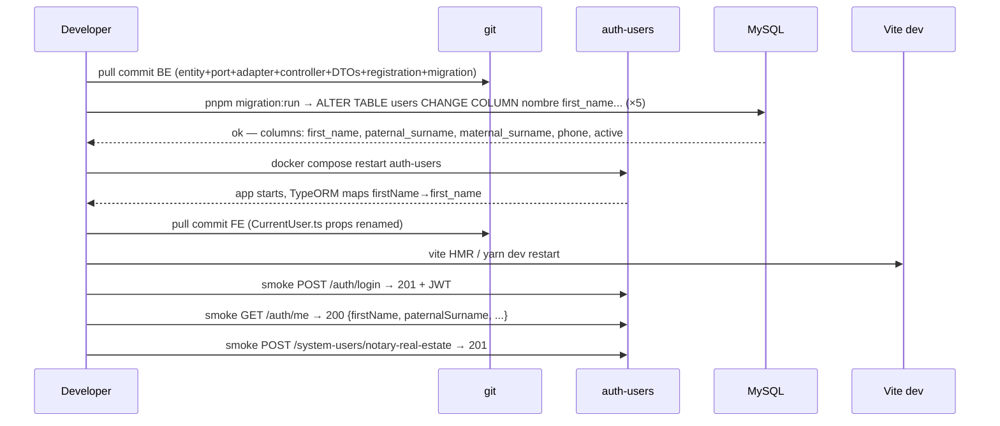

# Design: Rename users table + UserEntity + system-user HTTP contracts to English

Documenta cómo se ejecuta el rename atómico de columnas DB, propiedades TS en `UserEntity`, `CurrentUserDto`, `CreateUserInput`, y las rutas HTTP `POST /system-users/*`. Formato: un commit por sub-repo, sin ventana de dual-support.

## Approach

Sweep BE entity → port/adapter → HTTP layer → registration internals → DB migration → FE types. `tsc --noEmit` actúa como net de seguridad automático para identifiers TS; grep cubre string literals en test fixtures.

## Decisions

### D1 — Lockstep vs dual-support

| Option | Tradeoff | Decision |
|--------|----------|----------|
| Lockstep un solo commit | Requiere coordinación BE+FE en el mismo deploy | ✅ Elegido |
| Dual-name DTO (acepta español + inglés) | Duplica validators/mappers; legacy difícil de eliminar | Descartado |

Misma rationale que `rename-enums-to-english`: 0 consumidores externos verificados, workspace coordina ambos sub-repos.

### D2 — Migration shape: CHANGE COLUMN vs expand+backfill+restrict

| Option | Tradeoff | Decision |
|--------|----------|----------|
| `ALTER TABLE users CHANGE COLUMN nombre first_name VARCHAR(120) NOT NULL` | DDL directo, sin ventana de datos inconsistentes | ✅ Elegido |
| Expand+backfill+restrict (3 pasos) | Necesario solo cuando los datos tienen que transformarse (enums) | Descartado |

Las columnas a renombrar son VARCHAR opacos (strings de usuario); no son ENUM values que requieran backfill. Un solo DDL `CHANGE COLUMN` renombra la columna preservando datos intactos. Down migration usa `CHANGE COLUMN` en dirección inversa con los types originales exactos.

Tipos originales auditados en `UserEntity`:
- `nombre`: `VARCHAR(120) NOT NULL`
- `apellido_paterno`: `VARCHAR(120) NULL`
- `apellido_materno`: `VARCHAR(120) NULL`
- `telefono`: `VARCHAR(30) NULL`
- `activo`: `TINYINT(1) NOT NULL DEFAULT 1` (boolean en TypeORM)

### D3 — URL path rename strategy

| Option | Tradeoff | Decision |
|--------|----------|----------|
| Rename en lockstep, sin alias | Simple, sin deuda | ✅ Elegido |
| Mantener ruta vieja + redirect 301 | Agrega mantenimiento; 0 consumidores FE existentes | Descartado |

`/notario-inmobiliario` → `/notary-real-estate`, `/interno-externo-auxiliar` → `/internal-external-auxiliary`. El FE no consume estos endpoints (verificado con grep).

### D4 — Swagger description strings

| Option | Tradeoff | Decision |
|--------|----------|----------|
| Preservar `description:` en español | Coherente con regla de umbrella (display strings stays Spanish) | ✅ Elegido |
| Traducir a inglés | Viola la regla: solo identifiers/columns/paths se mueven | Descartado |

`@ApiProperty({ description: 'Nombre del usuario' })` permanece. `example: 'Carlos'` es dato realista de usuario hispanohablante — también permanece.

### D5 — TypeORM Column decorator `name:` attribute

**Choice**: actualizar el atributo `name:` en cada `@Column` en lockstep con el rename de la propiedad TS. Todos los 5 columns a renombrar tienen `name:` explícito (verificado en `user.entity.ts`). No hay columnas implícitas (default-name) entre las afectadas.

### D6 — Local variable rename en registration.service.ts

**Choice**: renombrar `userNombre` → `userFirstName`, `userApellidoPaterno` → `userPaternalSurname`, `userApellidoMaterno` → `userMaternalSurname` en L441-443. Puramente cosmético para grep-cleanliness.

### D7 — Test fixture sweep

**Choice**: hacer grep de `*.spec.ts` para `nombre:|apellidoPaterno:|apellidoMaterno:|telefono:|activo:` como object keys durante apply. Actualizar en el mismo commit.

### D8 — Sweep order

Orden estricto dentro del commit BE:
1. `UserEntity` — columnas DB + props TS
2. `users.port.ts` — `CreateUserInput` + `CurrentUserDto` props
3. `users.adapter.ts` — mapper `toCurrentUserDto` + insert `createUser`
4. `users.controller.ts` — mappings DTO→port + `@Post()` paths
5. `create-user.dto.ts` — props de ambas DTO classes (Swagger + class-validator)
6. `registration.adapter.ts:404-419` — internal createUser input keys
7. `registration.service.ts:441-443` — local vars
8. DB migration file
9. FE `CurrentUser.ts`
10. Builds + smoke

### D9 — Orden deploy vs migración

**Choice**: aplicar migración → reiniciar auth-users. Si la migración falla a mitad: el BE tiene props en inglés pero la DB tiene columnas Spanish → BE crashea en primera query. Recovery explícito: revertir commit BE + correr down migration.

### D10 — CreateUserOutput compatibility

`CreateUserOutput extends Omit<UserEntity, 'passwordHash'>` — heredará automáticamente los props renombrados de `UserEntity`. Sin cambio explícito en este tipo. Documentado para que apply no lo omita inadvertidamente.

### D11 — Swagger/OpenAPI auto-generated contract

El spec Swagger se regenera desde decorators. Tras el change, la UI mostrará props en inglés en `POST /system-users/*`. Colecciones Postman y docs externos necesitan actualización manual (responsabilidad del equipo).

## Sequence diagram — cutover local dev



## API contract changes

### GET /auth/me

| Field | Before | After |
|-------|--------|-------|
| `nombre` | `string` | removed |
| `firstName` | — | `string` |
| `apellidoPaterno` | `string \| null` | removed |
| `paternalSurname` | — | `string \| null` |
| `apellidoMaterno` | `string \| null` | removed |
| `maternalSurname` | — | `string \| null` |
| `telefono` | `string \| null` | removed |
| `phone` | — | `string \| null` |
| `activo` | `boolean` | removed |
| `active` | — | `boolean` |
| `id, email, role, profileType, profileId, lastLoginAt, mustChangePassword` | unchanged | unchanged |

### POST /system-users/notary-real-estate (was: notario-inmobiliario)

| Field | Before | After |
|-------|--------|-------|
| URL path | `/system-users/notario-inmobiliario` | `/system-users/notary-real-estate` |
| `nombre` | required | removed |
| `firstName` | — | required |
| `apellidoPaterno` | optional | removed |
| `paternalSurname` | — | optional |
| `apellidoMaterno` | optional | removed |
| `maternalSurname` | — | optional |
| `telefono` | optional | removed |
| `phone` | — | optional |
| `activo` | optional boolean | removed |
| `active` | — | optional boolean |
| `email, role` | unchanged | unchanged |

### POST /system-users/internal-external-auxiliary (was: interno-externo-auxiliar)

Misma tabla que arriba. Adicionalmente: `rfc` (optional) permanece sin cambio.

## File changes

### pld-api

| File | Action | Notes |
|------|--------|-------|
| `packages/domain-auth-users/src/entities/user.entity.ts` | Modify | 5 `@Column({ name: '...' })` + 5 TS property renames |
| `packages/domain-auth-users/src/ports/users.port.ts` | Modify | `CreateUserInput` + `CurrentUserDto` — 5 prop renames each |
| `packages/domain-auth-users/src/adapters/users.adapter.ts` | Modify | `toCurrentUserDto` mapper keys + `createUser` entity insert keys (L55-60) |
| `apps/auth-users/src/users/users.controller.ts` | Modify | 8 mapping references (L20-25, L32-37) + 2 `@Post()` paths |
| `apps/auth-users/src/users/dto/create-user.dto.ts` | Modify | Both DTO classes: 5 prop renames, Spanish `description:` preserved |
| `apps/auth-users/src/admin/registration/registration.adapter.ts` | Modify | L418-420 entity insert keys (nombre/apellidoPaterno/apellidoMaterno/activo) + L406-413 input type |
| `apps/auth-users/src/admin/registration/registration.service.ts` | Modify | L441-443 local vars (userNombre→userFirstName etc.) |
| `packages/persistence/migrations/20260426000000-rename-users-columns-to-english.sql` | Create | 5 `CHANGE COLUMN` DDL statements |
| `packages/persistence/migrations/20260426000000-rename-users-columns-to-english.down.sql` | Create | 5 `CHANGE COLUMN` DDL reversals |

### pld-web

| File | Action | Notes |
|------|--------|-------|
| `src/types/CurrentUser.ts` | Modify | 5 prop renames mirroring `CurrentUserDto` |

## Interfaces / Contracts

```typescript
// users.port.ts — after
export interface CreateUserInput {
  firstName: string;
  paternalSurname?: string | null;
  maternalSurname?: string | null;
  email: string;
  phone?: string | null;
  role: string;
}

export interface CurrentUserDto {
  id: string;
  email: string;
  role: UserRole;
  firstName: string;
  paternalSurname: string | null;
  maternalSurname: string | null;
  phone: string | null;
  active: boolean;
  profileType: ProfileType | null;
  profileId: string | null;
  lastLoginAt: string | null;
  mustChangePassword: boolean;
}
```

```sql
-- migration up (excerpt)
ALTER TABLE `users` CHANGE COLUMN `nombre` `first_name` VARCHAR(120) NOT NULL;
ALTER TABLE `users` CHANGE COLUMN `apellido_paterno` `paternal_surname` VARCHAR(120) NULL;
ALTER TABLE `users` CHANGE COLUMN `apellido_materno` `maternal_surname` VARCHAR(120) NULL;
ALTER TABLE `users` CHANGE COLUMN `telefono` `phone` VARCHAR(30) NULL;
ALTER TABLE `users` CHANGE COLUMN `activo` `active` TINYINT(1) NOT NULL DEFAULT 1;

-- migration down (excerpt — exact types from entity audit)
ALTER TABLE `users` CHANGE COLUMN `first_name` `nombre` VARCHAR(120) NOT NULL;
ALTER TABLE `users` CHANGE COLUMN `paternal_surname` `apellido_paterno` VARCHAR(120) NULL;
ALTER TABLE `users` CHANGE COLUMN `maternal_surname` `apellido_materno` VARCHAR(120) NULL;
ALTER TABLE `users` CHANGE COLUMN `phone` `telefono` VARCHAR(30) NULL;
ALTER TABLE `users` CHANGE COLUMN `active` `activo` TINYINT(1) NOT NULL DEFAULT 1;
```

## Testing strategy

| Layer | What | Approach |
|-------|------|----------|
| Type-check BE | All TS renames covered | `pnpm tsc --noEmit` from `pld-api` root → 0 errors |
| Type-check FE | `CurrentUser.ts` cascade | `yarn tsc -b --noEmit` → 0 errors |
| Build | App targets compile | `nx run auth-users:build`, `nx run cross:build`, FE `yarn build` |
| Migration | Up + down idempotent | `pnpm migration:run` → `pnpm migration:revert` → `pnpm migration:run` on local DB |
| Smoke | API contract | `POST /auth/login` 201+JWT; `GET /auth/me` 200 with `firstName`; `POST /system-users/notary-real-estate` 201 |
| Grep | 0 old identifiers outside migration | `grep -r 'nombre\|apellidoPaterno\|apellidoMaterno\|telefono\b\|\.activo\b' pld-api/{apps,packages}/*/src pld-web/src` → 0 (excluding migration files + Swagger description strings) |

## Migration / Rollout

Local dev: run migration → restart auth-users → pull FE commit → HMR. No downtime.

Recovery if migration fails mid-way: `pnpm migration:revert` (restores all 5 columns) + revert BE commit.

Active sessions at migration time: `GET /auth/me` will fail until auth-users restarts with new entity. Acceptable in dev. Production requires brief maintenance window or blue-green deploy.

## Open Questions

- [ ] Confirm migration timestamp `20260426000000` does not collide with an existing migration (last known: `20260425010000-rename-enums-to-english`). Use `20260426000000` unless apply finds a collision.
- [ ] Verify `getUserByPhone` in `users.adapter.ts:76` uses `{ telefono: input.telefono }` as the where clause — this is a TypeORM property name reference that must change to `{ phone: input.phone }` after rename. Confirm during apply.
