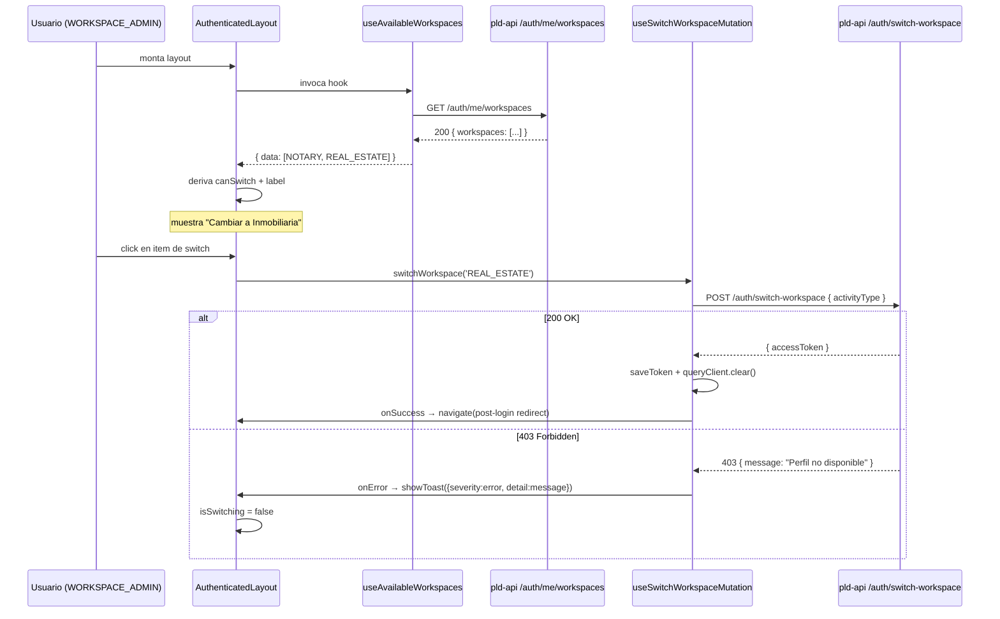
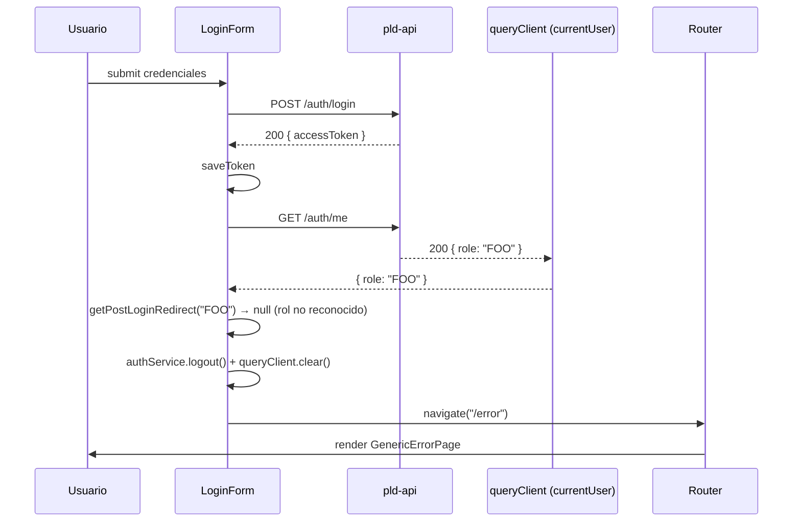

# Design: Implementar flujos de autenticación end-to-end

> Refines [proposal.md](./proposal.md). Specs delta: [specs/auth/spec.md](./specs/auth/spec.md), [specs/pld-web/spec.md](./specs/pld-web/spec.md).

## Decisiones arquitectónicas

### D1: Endpoint nuevo en el BE para listar workspaces COMPLETED

**Decisión**: agregar `GET /auth/me/workspaces` que devuelve `{ workspaces: Array<{ activityType, workspaceId }> }`.

**Alternativas descartadas**:

- **Incluir la lista en `GET /auth/me`**: contamina el DTO público con datos que solo importan en el contexto de switch. Además exigiría invalidar la query de `currentUser` después del switch (hoy se hace `queryClient.clear()`, que ya cubre el caso, pero acopla los dos contratos). Descartado por separación de concerns.
- **Embeber la lista en el JWT**: hace crecer el token y se vuelve stale apenas el usuario completa otra registration. Descartado.
- **Optimistic switch**: mantener el toggle hardcodeado y resolver el 403 con toast (Inconsistencia 2). Esta es la mitigación parcial actual y NO resuelve la inconsistencia 1 — el usuario sigue viendo una opción que no puede usar. Descartado.

**Justificación**: el BE ya ejecuta exactamente esta misma query en `AuthAdapter.queryCompletedRegistrations` durante `login` y `switchWorkspace`. Exponerla como recurso REST estándar reutiliza el código y centraliza la fuente de verdad. El endpoint queda protegido por `JwtAuthGuard` y devuelve solo datos del usuario autenticado — sin parámetros, sin riesgos de enumeration.

### D2: Path del recurso

**Decisión**: `GET /auth/me/workspaces`.

**Alternativas descartadas**:

- `GET /auth/workspaces`: ambigua respecto a "los workspaces del sistema" vs "los míos".
- `GET /me/workspaces`: rompe la convención actual de prefijar con `/auth` los recursos del módulo auth-users.
- `GET /registrations/completed`: filtra por status implícitamente; el cliente no necesita saber el detalle de `Registration`, solo `{ activityType, workspaceId }`.

**Justificación**: `/auth/me` ya es el namespace canónico para "datos del usuario autenticado". `/auth/me/workspaces` extiende naturalmente.

### D3: Rename del archivo del layout con espacio inicial

**Decisión**: `git mv "pld-web/src/layouts/ AuthenticatedLayout.tsx" pld-web/src/layouts/AuthenticatedLayout.tsx` y actualizar el único import en `pld-web/src/routes/index.tsx`.

**Alternativas descartadas**:

- **Mantener el espacio y documentarlo**: el archivo es un magnet de imports incorrectos; cualquier autocomplete que ignore el espacio crearía dos archivos.

**Justificación**: bug evidente; el costo de revertir es trivial (un `git mv` inverso).

### D4: Manejo de rol desconocido — redirect a `/error` (no a `/login`)

**Decisión**: cuando el FE detecta un `role` no reconocido, invalida la sesión local Y navega a `/error`. La pantalla `GenericErrorPage` muestra un mensaje genérico sin detalle técnico.

**Alternativas descartadas**:

- **Redirigir a `/login` con un toast**: el usuario tendría sus credenciales válidas pero la app no sabe qué hacer con su rol — entrar al loop login → me → /login es peor UX que un dead-end explícito.
- **Mostrar "Rol desconocido" al usuario**: revela un detalle interno que no aporta valor. La inconsistencia 5 explícitamente pide ocultar el motivo.

**Justificación**: rol no reconocido es un caso teórico (todos los usuarios tienen rol asignado en BD). La pantalla `/error` cubre este escenario de forma defensiva sin contaminar el flujo normal con casos hipotéticos.

### D5: `useAvailableWorkspaces` invalidado por `queryClient.clear()`

**Decisión**: NO agregar invalidación explícita en `onSuccess` del switch — `queryClient.clear()` ya barre todo el cache, incluyendo la query nueva. Mantener el comportamiento actual.

**Alternativas descartadas**:

- **`queryClient.invalidateQueries(['availableWorkspaces'])`**: redundante con `clear()`. Si en el futuro se reemplaza `clear()` por una invalidación selectiva, agregar la invalidación específica en ese momento.

**Justificación**: simpler is better. Una decisión documentada en este lugar previene over-engineering.

### D6: Decisión sobre fallback durante el loading inicial del menú

**Decisión**: mientras `useAvailableWorkspaces` está en `isLoading`, el menú-item de switch NO aparece. Sigue la regla de "no mostrar opciones que podrían ser inválidas".

**Alternativas descartadas**:

- **Mostrar deshabilitado con spinner**: agrega visual noise en el menú; la primera carga normalmente termina antes de que el usuario abra el menú.
- **Mostrar con label de placeholder ("Cambiar…")**: confunde antes de que se resuelva.

**Justificación**: el menú es transitorio; ocultar es más limpio que mostrar un estado intermedio.

### D7: AuxiliaryPlaceholderPage — sin diseño pendiente

**Decisión**: implementar la página como un componente mínimo (`<h1>Hola, AUXILIARY</h1>` o similar) sin lógica de negocio. El componente vive en `pld-web/src/pages/auxiliary/AuxiliaryPlaceholderPage.tsx`.

**Alternativas descartadas**:

- **Esperar al diseño definitivo**: bloquearía el cierre de la inconsistencia 6 sin razón. El placeholder mismo es la spec.

**Justificación**: el flujo `post-login.md` describe explícitamente esta pantalla como "placeholder, sin funcionalidad aún definida".

## Diagrama de secuencia: switch de workspace con verificación FE



## Diagrama de secuencia: redirect post-login con rol desconocido



## Contratos API ↔ Web

### Endpoint nuevo: `GET /auth/me/workspaces`

**Request**:
- Method: `GET`
- Path: `/pld-api/auth-users/auth/me/workspaces`
- Headers: `Authorization: Bearer <jwt>` (requerido)
- Body: ninguno

**Response 200**:
```json
{
  "workspaces": [
    { "activityType": "NOTARY", "workspaceId": "uuid-1" },
    { "activityType": "REAL_ESTATE", "workspaceId": "uuid-2" }
  ]
}
```

Headers:
- `Cache-Control: private, no-store`

**Response 401**: sigue el shape de error uniforme (token ausente, inválido o expirado).

**Casos límite**:
- `SUPERADMIN` → `{ workspaces: [] }`.
- Usuario sin registrations COMPLETED → `{ workspaces: [] }`.

### Tipo FE mirror

```ts
// pld-web/src/types/auth.ts
export interface AvailableWorkspace {
  activityType: ActivityType;
  workspaceId: string;
}

export interface AvailableWorkspacesResponse {
  workspaces: AvailableWorkspace[];
}
```

## Archivos afectados

### Nuevos

**BE (pld-api)**:
- _No archivos nuevos de schema/migration_ (el endpoint reusa la query existente).

**FE (pld-web)**:
- `pld-web/src/pages/auxiliary/AuxiliaryPlaceholderPage.tsx` — placeholder mínimo.
- `pld-web/src/pages/error/GenericErrorPage.tsx` — pantalla genérica de error.
- (Opcional, si se decide modular) `pld-web/src/queries/authQueries.ts` agrega `useAvailableWorkspaces` — no archivo nuevo, solo export adicional. Alternativamente puede vivir en un archivo `useAvailableWorkspaces.ts` aparte.

### Modificados

**BE (pld-api)**:
- `pld-api/apps/auth-users/src/auth/auth.controller.ts` — handler `GET me/workspaces`.
- `pld-api/packages/domain-auth-users/src/ports/auth.port.ts` — agregar método `getCompletedWorkspaces(userId)` al puerto.
- `pld-api/packages/domain-auth-users/src/adapters/auth.adapter.ts` — exponer la query existente `queryCompletedRegistrations` vía el método público `getCompletedWorkspaces`. Sin cambios de SQL.

**FE (pld-web)**:
- `pld-web/src/layouts/ AuthenticatedLayout.tsx` → rename a `pld-web/src/layouts/AuthenticatedLayout.tsx` + lógica:
  - Reemplazar `canSwitch` y `alternativeActivityType` por derivación desde `useAvailableWorkspaces`.
  - Agregar import del hook.
- `pld-web/src/routes/index.tsx`:
  - Corregir import del layout.
  - Agregar `RoutesUrl.AUXILIARY` route (bajo `AuthenticatedLayout` + `RoleProtectedRoute([AUXILIARY])`).
  - Agregar `RoutesUrl.ERROR` route (estática, sin guard).
- `pld-web/src/routes/routes-urls.ts` — agregar `AUXILIARY: "/auxiliary"` y `ERROR: "/error"`.
- `pld-web/src/config/postLoginRedirect.ts`:
  - Agregar mapping `[UserRole.AUXILIARY]: RoutesUrl.AUXILIARY`.
  - Cambiar `DEFAULT_REDIRECT` o agregar una función paralela `getPostLoginAction(role)` que retorne `{ kind: 'navigate', to } | { kind: 'logout-and-error' }` cuando el rol no esté en `POST_LOGIN_REDIRECT_BY_ROLE`. **Alternativa más simple** (preferida): exportar un helper `isKnownRole(role)` y dejar al consumer (LoginForm) la lógica de "si rol desconocido → logout + navigate /error". Documentado en tasks.
- `pld-web/src/components/organisms/auth/LoginForm/index.tsx`:
  - Cambiar label "Correo electrónico" → "Correo Electrónico o Nickname" (verificar texto exacto contra el flujo).
  - Agregar manejo de rol desconocido tras `fetchQuery({ queryKey: ['currentUser'] })` (rama nueva en el `try`).
- `pld-web/src/components/organisms/auth/ForgotPasswordForm/index.tsx`:
  - Cambiar subtítulo "Ingresa tu correo o teléfono para continuar" → "Ingresa tu correo electrónico o nickName para continuar".
- `pld-web/src/queries/authQueries.ts`:
  - Agregar `useAvailableWorkspaces`.
  - Agregar `onError` a `useSwitchWorkspaceMutation` que llama `showToast`.
- `pld-web/src/services/authService.ts` (opcional) — agregar `getAvailableWorkspaces()` que llama el endpoint nuevo. Alternativamente vivir en `userService.ts`.

## Open Questions

- **Ubicación del método de servicio** (`authService` vs `userService`): se prefiere `userService.getAvailableWorkspaces()` porque conceptualmente son datos del usuario; pero `authService.getMyWorkspaces()` también es defendible. Decisión final en la fase de apply — no afecta los contratos.
- **Forma del mapping `AUXILIARY`**: si `RoutesUrl.AUXILIARY` debe ser `"/auxiliary"` o `"/auxiliary/dashboard"` o similar. Se elige `"/auxiliary"` por simplicidad; refactor trivial si el diseño definitivo cambia.
